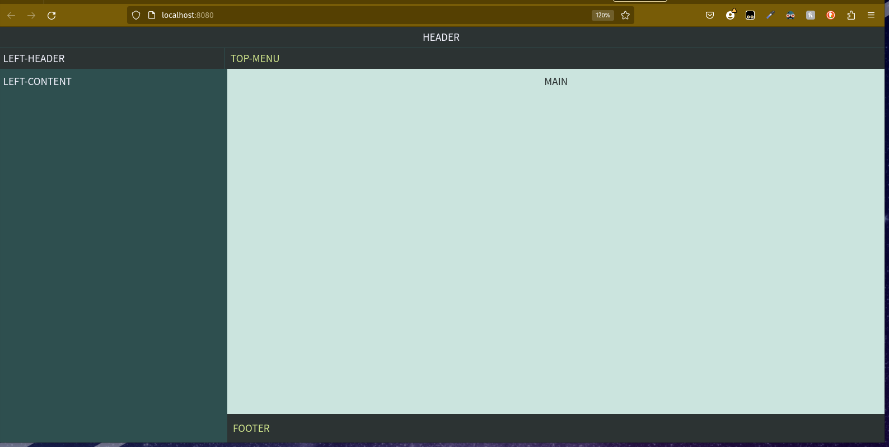

## Section 2.1: Layout components


Before we begin, lets start with a brand new `index.html`
lets delete everything we added inside the `body` tag.
your `index.html` should look like this:
```html
<!DOCTYPE html>
<html lang="en">

<head>
  <meta charset="UTF-8">
  <meta http-equiv="X-UA-Cod1hhmpatible" content="IE=edge">
  <meta name="viewport" content="width=device-width, initial-scale=1.0">
  <title>Document</title>
</head>

<body>


</body>

</html>
```

### Activity 2.1.1: App layout

Inside the `body` tag on `index.html` lets use the `app-layout` tag to create an empty application layout 
The slot name will be displayed in the browser:
```html
   <app-layout></app-layout>
```

By using this tag, we should be able to see in the browser, an empty shell for a web application, the names you see in each section is the name of the corresponding slot.


Let's fill the `header`, `left-header`, `left-menu`, `top-menu` and `footer` slots. Here we are adding some titles and a navigation bar on top with 3 routes:
```html
  <style>
    nav a {
      color: var(--main-tone);
      padding: 2px 4px;
    }
  </style>
  <app-layout>
    <header slot="header">Welcome to our memory flip game</header>
    <b slot="left-header">Game stats</b>

    <nav slot="top-menu" class="">
      <a href="#">Home</a>
      <a href="#game">Game</a>
      <a href="#game-log">Game Log</a>
    </nav>

    <footer slot="footer">Thank you.</footer>
  </app-layout>
```

Now, on the left-content, lets add some components - a `plain-card` on top and an `app-accordion` below:  
```html
   ...
    </nav>

    <section slot="left-content">
      <plain-card></plain-card>
      <app-accordion></app-accordion>
    </section>

    <footer slot="foother">Thank you.</footer>
    ...
```

There are 2 slots in `plain-card` - `title` to add text to upper bar, and `main` to add the content of the card.
Let's add some placeholders for the score:
```html
  <plain-card>
     <h2 slot="title">My Score</h2>
     <section slot="main">
        <div>
          <b>Level:</b><span data-key="level"></span><br>
          <b>Attempts:</b><span data-key="attempts"></span><br>
          <b>Username:</b><span data-key="username"></span><br>
        </div>
     </section>
   </plain-card>
```

For the accordion, we only use one slot, so it's not require to specify the slot attribute. Everything passed to this component will be added inside the accordion.
Every item on the accordion should be wrapped on a tag, like `section`, `article` or `div`. Also, the first item should be a <h*> like `h1`, `h2` and so on. This will be adopted as the title on the accordion tab.
Here let's add the instructions for our game:
```html
   <app-accordion>
      <section>
       <h5>Game instructions</h5>
       <p>This is a memory game, where you have to find pairs in a set of cards.</p>
       <p>You will have X minutes to solve multiple challenges and the score will be based on how far you get.</p>
      </section>
      <section>
       <h5>FAQs</h5>
       <b>Question 1:</b>
       <p>Answer 1</p>
       <hr>
       <b>Question 2:</b>
       <p>Answer 2</p>
       <hr>
      </section>
   </app-accordion>
```

So far, this is our `index.html`
```html
<!DOCTYPE html>
<html lang="en">

<head>
  <meta charset="UTF-8">
  <meta http-equiv="X-UA-Cod1hhmpatible" content="IE=edge">
  <meta name="viewport" content="width=device-width, initial-scale=1.0">
  <title>Document</title>
</head>

<body>

  <style>
    nav a {
      color: var(--main-tone);
      padding: 2px 4px;
    }
  </style>
  <app-layout>
    <header slot="header">Welcome to our memory flip game</header>
    <b slot="left-header">Game stats</b>

    <nav slot="top-menu" class="">
      <a href="#">Home</a>
      <a href="#game">Game</a>
      <a href="#game-log">Game Log</a>
    </nav>

    <section slot="left-content">
      <plain-card>
        <h2 slot="title">My Score</h2>
        <section slot="main">
          <div>
            <b>Level:</b><span data-key="level"></span><br>
            <b>Attempts:</b><span data-key="attempts"></span><br>
            <b>Username:</b><span data-key="username"></span><br>
          </div>
        </section>
      </plain-card>

      <app-accordion>
        <section>
          <h5>Game instructions</h5>
          <p>This is a memory game, where you have to find pairs in a set of cards.</p>
          <p>You will have X minutes to solve multiple challenges and the score will be based on how far you get.</p>
        </section>
        <section>
          <h5>FAQs</h5>
          <b>Question 1:</b>
          <p>Answer 1</p>
          <hr>
          <b>Question 2:</b>
          <p>Answer 2</p>
          <hr>
        </section>
      </app-accordion>

    </section>

    <footer slot="footer">Thank you.</footer>
  </app-layout>


</body>

</html>
```

And this is how it should look on the browser


So, the `main` slot is the last one to fill, but before doing it, let's talk about routing.


### Activity 2.1.2: Hash routing
In the previous Lesson we added 3 links at the top of the page - `home`, `game` and `game-log`.
In order to handle them we'll make use of hash routing. In other words, we will display different content with different hashes (#users, #orders and so on) of the url. https://subdomain.domain.tld/route#hash.

To detect and handle these hash changes, we have the `app-router` and `app-route` components.
The first one, `app-router`, is the parent element, and is the one that listens for changes in the url and allows the child `app-route` to activate or not.

Lets add an `app-router` as the main slot:
```html
  ...
         </section>
      </app-accordion>
    </section>

    <app-router slot="main">
      <!-- routes will be here -->
    </app-router>

    <footer slot="footer">Thank you.</footer>
  ...
```

For each individual route, we will use an `app-route`.
This component has the attribute `hash="<hash_rotue>"` to specify when it should be displayed or not.
For the default route, don't specify the `hash` attribute.

Let's add `app-route` for the 3 routes we have:
```html
  ...
   <app-router slot="main">

      <app-route>I'm Home</app-route>
      <app-route hash="game" >I'm Game</app-route>
      <app-route hash="game-log" >I'm Game Log</app-route>

   </app-router>
  ...
```

This router componet is adding the class `.hidden`
```css
    .hidden {
      display: none;
    }
```

Now, if you test in your browser, you should be able to navigate and see page changes on your app. Note the hash part on the url match the route you are seeing.


`app-router` emits a `navigated` event when there is a change in the url and it will activate the proper `app-route`.
This `app-route`, when the hash is matched, it will display its content and it will emit the `activated` event.

Let's see this in action by adding an `app-modal` that asks for a username every time we navigate to the `Game` page.
fFrst, let's add an `id` attribute to the game route:
```html
  <app-route id="game-route" hash="game">
```
Then let's add an `app-modal` and set the `trigger` and the `on` attributes:
```html
  ...
   <app-router slot="main">

      <!-- add this modal before all the app-route elements -->
      <app-modal id="username-selection-modal" trigger="#game-route" on="activated">
        <h1 slot="title">Start a new match</h1>
        <section slot="main">
          <p>Ready to start a new match?</p>
          <p>Choose a username and let's play</p>
          <form>
            <label>Username:</label><input type="text" name="username">
          </form>
        </section>
      </app-modal>
  
      <app-route>
  ...
```

On the game route, let's reflect the username.
Let's add an `ui-data-sync` to get the `username` input from `app-modal` and place it inside a `span` tag. 
**Note:** The input name must match the data-key attribute on the desired target element.

```html
   ...
   <app-route id="game-route" hash="game">
     <h1>I'm Game</h1>
     <ui-data-sync trigger="#username-selection-modal" on="accepted" >
       <p>Welcome <span data-key="username"></span></p>
     </ui-data-sync>
   </app-route>
   ...
```

And lastly, lets log every route change in the console.
```html
   ...
   </app-modal>

      <script>
        document
          .querySelector('app-router')
          .addEventListener('navigated', event =>
            console.log(`navigated to ${event.detail.hash || 'home'}`))
      </script>

      <app-route>
   ...
```

This is how our `index.html` should looks:
```html
<!DOCTYPE html>
<html lang="en">

<head>
  <meta charset="UTF-8">
  <meta http-equiv="X-UA-Cod1hhmpatible" content="IE=edge">
  <meta name="viewport" content="width=device-width, initial-scale=1.0">
  <title>Document</title>
</head>

<body>

  <style>
    /* this class is to hide routes */
    .hidden {
      display: none;
    }

    nav a {
      color: var(--main-tone);
      padding: 2px 4px;
    }
  </style>
  <app-layout>
    <header slot="header">Welcome to our memory flip game</header>
    <b slot="left-header">Game stats</b>

    <nav slot="top-menu" class="">
      <a href="#">Home</a>
      <a href="#game">Game</a>
      <a href="#game-log">Game Log</a>
    </nav>

    <section slot="left-content">
      <plain-card>
        <h2 slot="title">My Score</h2>
        <section slot="main">
          <div>
            <b>Level:</b><span data-key="level"></span><br>
            <b>Attempts:</b><span data-key="attempts"></span><br>
            <b>Username:</b><span data-key="username"></span><br>
          </div>
        </section>
      </plain-card>

      <app-accordion>
        <section>
          <h5>Game instructions</h5>
          <p>This is a memory game, where you have to find pairs in a set of cards.</p>
          <p>You will have X minutes to solve multiple challenges and the score will be based on how far you get.</p>
        </section>
        <section>
          <h5>FAQs</h5>
          <b>Question 1:</b>
          <p>Answer 1</p>
          <hr>
          <b>Question 2:</b>
          <p>Answer 2</p>
          <hr>
        </section>
      </app-accordion>
    </section>

    <app-router slot="main">

      <app-modal id="username-selection-modal" trigger="#game-route" on="activated">
        <h1 slot="title">Start a new match</h1>
        <section slot="main">
          <p>Ready to start a new match?</p>
          <p>Choose a username and let's play</p>
          <form>
            <label>Username:</label><input type="text" name="username">
          </form>
        </section>
      </app-modal>

      <app-route>home</app-route>

      <app-route id="game-route" hash="game">
        <h1>I'm Game</h1>
        <ui-data-sync trigger="#username-selection-modal" on="accepted">
          <p>Welcome <span data-key="username"></span></p>
        </ui-data-sync>
      </app-route>
      
      <app-route hash="game-log">Game Log</app-route>
    
    </app-router>

    <footer slot="footer">Thank you.</footer>
  </app-layout>


</body>

</html>
```


And on the broswer:


### Activity 2.1.3: Grid layout
on `web-components-app/src/components` create the `grid-layout` folder
then create the `index.js` on `web-components-app/src/components/grid-layout` with the following content:
```js
  export * from './grid-layout'
```
then lets create `grid-layout.js` on the same folder and let's initialize an emtpy component
```js
   import { html, registerTriggers } from '../../lib/web-tools'

   export default class GridLayoutComponent extends HTMLElement {

     constructor() {
       super()
       const template = html``
       this.attachShadow({ mode: 'open' })
       this.shadowRoot.appendChild(template)
     }

     connectedCallback() {
       registerTriggers(this, (event) => console.log(event))
     }

   }

   window.customElements.define('grid-layout', GridLayoutComponent)
```

And now lets add this new component on `src/components/index.js`
```js 
export * from './secret-card' // this is the one we already have

export * from './grid-layout' // add this one
```


Now, in order to render the content that is passed between the `<grid-layout>this content </grid-layout>` we need to use a `slot` tag.
Because for our use case, this component will only have one slot, there is no need to specify the slot name when consuming this `grid-layout`

lets go back to the constructor function and add the slot tag
```js
// replace this...
const template = html``

// for this...
const template = html`
  <style>
    /* here we will add some styles on the next step */      
  </style>
  <div id="grid-container">
    <slot></slot>
  </div>
`
```

Now that we added the string template for our html, lets add some css to enable the grid.

**Note:** _because we are using a template string from javascript, we will be getting some values dinamycally from js, this will only work on first load, if the value of the grid change we won't react to that change, we will cover those changes later on the lab_

On the `style` tag lets add the css for a grid layout
```css
#grid-container {
   display: grid;
   grid-template-columns: repeat(${this.getAttribute('columns')}, 1fr);
   grid-template-rows: repeat(${this.getAttribute('rows')}, 1fr);
   grid-gap: ${ this.getAttribute('gap') || '20px'};
}
```


This will be enogh to test our component,  no grid so far.
On `index.html` lets add the following snippet on the `#game` route:

```html
   <grid-layout gap="1px" columns="2" rows="2">
    <flip-card></flip-card>
    <flip-card></flip-card>
    <flip-card></flip-card>
    <flip-card></flip-card>
   </grid-layout>
```


This is the full `grid-layout.js`:
```js
import { html, registerTriggers } from '../../lib/web-tools'

export default class GridLayoutComponent2 extends HTMLElement {

  constructor() {
    super()
    const template = html`
      <style>
        #grid-container {
          display: grid;
          grid-template-columns: repeat(${this.getAttribute('columns')}, 1fr);
          grid-template-rows: repeat(${this.getAttribute('rows')}, 1fr);
          grid-gap: ${ this.getAttribute('gap') || '20px'};
        }
      </style>

      <div id="grid-container">
        <slot></slot>
      </div>
    `
    this.attachShadow({ mode: 'open' })
    this.shadowRoot.appendChild(template)
  }

  connectedCallback() {
    registerTriggers(this, (event) => console.log(event))
  }

}

window.customElements.define('grid-layout-2', GridLayoutComponent2)
```

and the full `index.html`:
```html
<!DOCTYPE html>
<html lang="en">

<head>
  <meta charset="UTF-8">
  <meta http-equiv="X-UA-Cod1hhmpatible" content="IE=edge">
  <meta name="viewport" content="width=device-width, initial-scale=1.0">
  <title>Document</title>
</head>

<body>

  <style>
    /* this class is to hide routes */
    .hidden {
      display: none;
    }

    nav a {
      color: var(--main-tone);
      padding: 2px 4px;
    }
  </style>
  <app-layout>
    <header slot="header">Welcome to our memory flip game</header>
    <b slot="left-header">Game stats</b>

    <nav slot="top-menu" class="">
      <a href="#">Home</a>
      <a href="#game">Game</a>
      <a href="#game-log">Game Log</a>
    </nav>

    <section slot="left-content">
      <plain-card>
        <h2 slot="title">My Score</h2>
        <section slot="main">
          <div>
            <b>Level:</b><span data-key="level"></span><br>
            <b>Attempts:</b><span data-key="attempts"></span><br>
            <b>Username:</b><span data-key="username"></span><br>
          </div>
        </section>
      </plain-card>

      <app-accordion>
        <section>
          <h5>Game instructions</h5>
          <p>This is a memory game, where you have to find pairs in a set of cards.</p>
          <p>You will have X minutes to solve multiple challenges and the score will be based on how far you get.</p>
        </section>
        <section>
          <h5>FAQs</h5>
          <b>Question 1:</b>
          <p>Answer 1</p>
          <hr>
          <b>Question 2:</b>
          <p>Answer 2</p>
          <hr>
        </section>
      </app-accordion>
    </section>

    <app-router slot="main">

      <app-modal id="username-selection-modal" trigger="#game-route" on="activated">
        <h1 slot="title">Start a new match</h1>
        <section slot="main">
          <p>Ready to start a new match?</p>
          <p>Choose a username and let's play</p>
          <form>
            <label>Username:</label><input type="text" name="username">
          </form>
        </section>
      </app-modal>

      <app-route>home

        <grid-layout-2 gap="1px" columns="2" rows="2">
          <flip-card></flip-card>
          <flip-card></flip-card>
          <flip-card></flip-card>
          <flip-card></flip-card>
        </grid-layout-2>

      </app-route>

      <app-route id="game-route" hash="game">
        <h1>I'm Game</h1>
        <ui-data-sync trigger="#username-selection-modal" on="accepted">
          <p>Welcome <span data-key="username"></span></p>
        </ui-data-sync>
      </app-route>
      
      <app-route hash="game-log">Game Log</app-route>
    
    </app-router>

    <footer slot="footer">Thank you.</footer>
  </app-layout>


</body>

</html>
```

And we should see a 2 by 2 grid of flip cards


