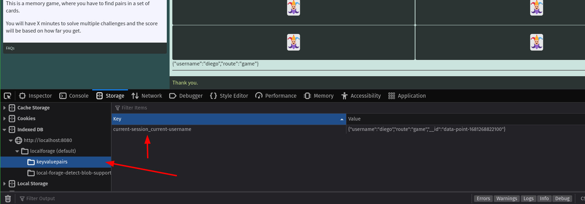
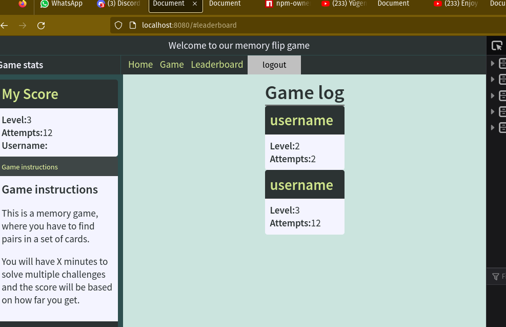

## Section 2.3: Data components

This are web components created to help us store and query data on html as oposed to create variables in JavaScript.

### Activity 2.3.1: Data point and data set

A `data-point` tag represents a single data entry. Imagine this as a record in a SQL table.

A `data-set` is a collection of data points.

We can make the `data-set` listen for events and add its content as a data point.
Inside an event, data will live either on `event.detail` or `event.target.dataset`.


Let's see this in action.
When we pass a level, `memory-flip-board` will emit the `levelup` event, we can capture the data from that event to use it later in other parts of the UI.

Create a `data-set` tag under the `memory-flip-board`, we will give it and id and we will set up the `trigger` to the `memory-flip-board` id, and the `on` attribute will be `levelup`:
```html
   <!-- add dataset under this tag <memory-flip-board id="game-board" level="2"  preview></memory-flip-board> -->

   <data-set id="current-level" visible trigger="#game-board" on="levelup"></data-set>
```
The `visible` attibute is for dev pourposes, it will allow us to see a changelog of the value.

If you inspect the html of the page, you will see a new `data-point` every time the there is an event on `data-set`
```html
   <data-point id="data-point-1681247878649" visible="" data-level="5" data-__id="data-point-1681246258858"></data-point>
```

the field `id` and `data-__id` is automatically added if none provided, this is the id of the record and shoudl be unique in the page.


Data sets emit an `updated` event when something change.
lets go back to the `app-route` for the `#games` route and lets dynamically update the level on the UI.

Inside `app-route#game-route`, lets add a new `ui-data-sync` to keep track of the current level:
```html
  <ui-data-sync trigger="#current-level" on="updated">
    <h1>On level <span data-key="level">1</span></h1>
  </ui-data-sync>
  ...
```


Now that we have this new tool, lets save all the important information so we don't have to promt the user for it.

First, lets save the username, the one we get when the navigation to game page happends, [on step 2.1.2](#activity-212-hash-routing)

Under our previous `data-set`, lets create a new one, we are going to use the `#username-selection-modal` the one that opens when the #game page is activated
```html
  // username-selection-modal is the modal that pop up every time we navigate to #game
  <data-set id="current-username" trigger="#username-selection-modal" on="accepted" visible ></data-set>
```

On the game route, the `ui-data-sync` that is listening to the same modal, lets switch it to listen to the new `data-set`. Our goal here is to link that UI change to the dataset instead of the modal. (for decoupling)
```html
     change ...    
     <ui-data-sync trigger="#username-selection-modal" on="accepted">
     
     for ...
     <ui-data-sync trigger="#current-username" on="updated">
   ...
```


Lastly, lets add another `data-set` that will act as our game log, this time we will use the `append` attribute to let the data set know that `all` values should be stored.

Think of a data-set without the append as a regular variable and with the append as an array.
```html
  <data-set id="score-log" visible append trigger="#game-board" on="levelup"></data-set>
```
No extra UI changes for this one just yet

### Activity 2.3.2: Data query

Great! Now we can store data, but we can only create data-points.
In order to delete, update or append we can use the `data-query` component.
This component provide an easy way to perfrom crud operation on data sets.

operations like:
- `get` an item
- `list` items
- `put` an item
- `delete` an item
- `clear` all the items

When a query is perfomed, the result will be delivered as an event, the type of the event will be the same as the type of operation, like the ones in the previous list.

Lets add a query to clear the current username. Inside the `data-set` for `current-username`
lets add a `data-query` inside the `data-set#current-username`
```html
  ...
  <data-set id="current-username" trigger="#username-selection-modal" on="accepted" visible>

    <!-- add this line -->
    <data-query id="clear-current-user" type="clear" trigger="#logout-btn" on="click">

  </data-set>
  ...
```
And lets add a logout button with the matching id. In the `app-layout` on the `header` slot, lets add the button inside the nav tag
```html
  ...
  <app-layout>

    <header slot="header">Welcome to our memory flip game</header>
    <b slot="left-header">Game stats</b>
    <nav slot="top-menu" class="">
      <a href="#">Home</a>
      <a href="#game">Game</a>
      <a href="#score-log">Game Log</a>

      <!-- add this button -->
      <button id="logout-btn">logout</button>
    </nav>
 ...
```

for `#get-current-level` data set, we are only using a get query, no trigger for now.
```html
   <data-set id="current-level" trigger="#game-board" on="levelup">

    <!-- add this line -->
      <data-query id="get-current-level" type="get"></data-query>

  </data-set>
```

and for `#score-log`, because this is is appending all events, the if we use `get` it will emit an event with an array of values, if we use `list` instead, it will emit an event for each `data-point`. This is great, so each item will be handled individually. No trigger for now.
```html
  <data-set id="score-log" visible append trigger="#game-board" on="levelup">

    <!-- add this line -->
    <data-query id="list-game-logs" type="list"></data-query>

  </data-set>
```

If we interact with the application, provide a username, and win a level, we shold be able to see data points in all data-sets


### Activity 2.3.3: Data store

Data sets are great! they help us to store state and share it accros our webapp.
The only issue is, they are not persistent, if we refresh the browsers, that data is gone.
would it be nice if we just have a magic tag, that by only wraping our data sets on it, it will store all of it on [IndexedDB](https://developer.mozilla.org/en-US/docs/Web/API/IndexedDB_API/Using_IndexedDB) or [localStorage](https://developer.mozilla.org/en-US/docs/Web/API/Window/localStorage) and it magically integrates with all the `data-query` we alreary wrote...


Introducing... (>\*.\*)> `data-store` <(\*.\*<) 
This component will handle the heavy lifting of setting up IndexedDB and keeping datasets in sync after a refresh.

Lets see it in action!


Create a `data-store` tag with an id of `session-store` and move the `#current-username` and `#current-level` data sets inside it. Data store will only interact with children data sets 


```html
...
<data-store id="session-store">

  <!-- existing session dataset -->
  <data-set id="current-level" trigger="#game-board" on="levelup">
    ...

  <!-- existing username dataset -->
  <data-set id="current-username" trigger="#username-selection-modal" on="accepted" visible>
    ...

</data-store>
...
```

And create another `data-store` for the `#score-log` remember this new component should wrap the desired `data-set`:
```html
...
<data-store id="logs-store">

  <!-- game log dataset -->
  <data-set id="score-log" visible append trigger="#game-board" on="levelup">
    ...
</data-store>
...
```

After this, go to the browser refresh the app, provide a username and open devtools go to storage, and indexeddb. There you should see an entry with the key `session-store_current-username` the value is a json wich contains the username you provided.



Play the first level and refresh indexeddb again


And now we see both data stores and all the data-sets.

_note: the IndexedDB key is composed from the data-store id and the data-set id_

Also notice that datasets will keep their state when refresh


So far, this is how `index.html` looks like:
```html
<!DOCTYPE html>
<html lang="en">

<head>
  <meta charset="UTF-8">
  <meta http-equiv="X-UA-Cod1hhmpatible" content="IE=edge">
  <meta name="viewport" content="width=device-width, initial-scale=1.0">
  <title>Document</title>
</head>

<body>

  <style>
    /* this class is to hide routes */
    .hidden {
      display: none;
    }

    nav a {
      color: var(--main-tone);
      padding: 2px 4px;
    }
  </style>
  <app-layout>
    <header slot="header">Welcome to our memory flip game</header>
    <b slot="left-header">Game stats</b>

    <nav slot="top-menu" class="">
      <a href="#">Home</a>
      <a href="#game">Game</a>
      <a href="#score-log">Game Log</a>
      <button id="logout-btn">logout</button>
    </nav>

    <section slot="left-content">
      <plain-card>
        <h2 slot="title">My Score</h2>
        <section slot="main">
          <div>
            <b>Level:</b><span data-key="level"></span><br>
            <b>Attempts:</b><span data-key="attempts"></span><br>
            <b>Username:</b><span data-key="username"></span><br>
          </div>
        </section>
      </plain-card>

      <app-accordion>
        <section>
          <h5>Game instructions</h5>
          <p>This is a memory game, where you have to find pairs in a set of cards.</p>
          <p>You will have X minutes to solve multiple challenges and the score will be based on how far you get.</p>
        </section>
        <section>
          <h5>FAQs</h5>
          <b>Question 1:</b>
          <p>Answer 1</p>
          <hr>
          <b>Question 2:</b>
          <p>Answer 2</p>
          <hr>
        </section>
      </app-accordion>
    </section>

    <app-router slot="main">

      <app-modal id="username-selection-modal" trigger="#game-route" on="activated">
        <h1 slot="title">Start a new match</h1>
        <section slot="main">
          <p>Ready to start a new match?</p>
          <p>Choose a username and let's play</p>
          <form>
            <label>Username:</label><input type="text" name="username">
          </form>
        </section>
      </app-modal>

      <app-route>home


      </app-route>

      <app-route id="game-route" hash="game">

        <ui-data-sync trigger="#current-level" on="updated">
          <h1>On level <span data-key="level">1</span></h1>
        </ui-data-sync>

        <ui-data-sync trigger="#current-username" on="updated">
          <p>Welcome <span data-key="username">user</span></p>
        </ui-data-sync>

        <memory-flip-board-2 id="game-board" level="2"></memory-flip-board-2>

        <data-store id="session-store">

          <data-set id="current-level" visible trigger="#game-board" on="levelup">
            <data-query id="get-current-level" type="get"></data-query>
          </data-set>
          
          <data-set id="current-username" trigger="#username-selection-modal" on="accepted" visible >
            <data-query id="clear-current-user" type="clear" trigger="#logout-btn" on="click"></data-query>
          </data-set>
          
        </data-store>

        <data-store id="logs-store">

          <data-set id="score-log" visible append trigger="#game-board" on="levelup">
            <data-query id="list-game-logs" type="list"></data-query>
          </data-set>
          
        </data-store>

      </app-route>

      <app-route hash="score-log">Game Log</app-route>

    </app-router>

    <footer slot="footer">Thank you.</footer>
  </app-layout>


</body>

</html>
```


### Activity 2.3.4: UI sync components

We are already familiar with the `ui-data-sync`, we used a couple of time already, but there are other 2 components we can leverage to make this application interactive.

But first lets warm up with the familiar `ui-data-sync`. 

There are 2 important values we always want to keep up to date,  `username` and `score`.
For `username`, we currently have an `ui-data-sync` listening to an `app-modal` we want to change that for the  `current-username` data set: 
the `app-modal`
```html
from ...
<ui-data-sync trigger="#username-selection-modal" on="accepted">
  <p>Welcome <span data-key="username"></span></p>
</ui-data-sync>
to...
<ui-data-sync trigger="#current-username" on="updated">
  <p>Welcome <span data-key="username"></span></p>
</ui-data-sync>
...
```

And for `score` we already have a place on the UI for this, the `plain-card` on the left for this step is to reflect the current score on the `left-content` slot from `app-layout` component.
Here we want to add the `ui-data-sync` component around the `div` that contain the labels and inputs for level and attempts:
```html
<plain-card>
  ...
  <section slot="main">
    ...

    <!-- add ui-data-sync -->
    <ui-data-sync trigger="#current-level" on="updated">
      <div>
        <!-- add <span data-key="xxx"> to let ui-data-sync know what value to replace -->
        <b>Level:</b><span data-key="level"></span><br>
        <b>Attempts:</b><span data-key="attempts"></span><br>
      </div>
    </ui-data-sync>


  ...
  </section>
</plain-card>
...
```


On the score-log route, our goal is to display a list of plain cards, each one will represent a new game log from `#score-log` data set. `ui-data-sync` works great with a single item, but how can we handle when a `data-set` has the `append` attribute. In this case, we can use the `ui-data-repeat`.

This component will listen to an event, and it will create a new ui element for each event.

We need to provide a the html that we want `ui-data-repeat` to use. To achieve this, we are going to usethe [template](https://developer.mozilla.org/en-US/docs/Web/HTML/Element/template) tag

The html that go inside the `template` tag will be cloned and used for each event.
Remember `data-key` attribute or `name` attribute will be used to let the ui component know where to add the values of the event.

On the score-log route, lets replace its content with this:
```html
<!--  add the ui-data-repeat inside <app-route hash="score-log"> tag -->
  ...

  <h1>Game log</h1>
  <hr>


  <!-- listening to gale log dataset fot the updated event -->
  <ui-data-repeat id="score-log-cards" trigger="#score-log" on="updated">

    <!-- the content inside of a template tag won't be rendered by the browser -->
    <template>
      <plain-card>
        <h2 slot="title" data-key="username">username</h2>
        <section slot="main">

          <!-- data-key let ui-data-repeat know where to add the values from the event -->
          <b>Level:</b><span data-key="level"></span><br>
          <b>Attempts:</b><span data-key="attempts"></span><br>
        </section>
      </plain-card>
    </template>
  </ui-data-repeat>


...
<!-- </app-route> -->
```

Lets test on the browser!!

We only need to refresh and win a couple of maches then navigate to the `score-log` page and we should see our log.

The final version should look like this:
```html
<!DOCTYPE html>
<html lang="en">

<head>
  <meta charset="UTF-8">
  <meta http-equiv="X-UA-Cod1hhmpatible" content="IE=edge">
  <meta name="viewport" content="width=device-width, initial-scale=1.0">
  <title>Document</title>
</head>

<body>

  <style>
    /* this class is to hide routes */
    .hidden {
      display: none;
    }

    nav a {
      color: var(--main-tone);
      padding: 2px 4px;
    }
  </style>
  <app-layout>
    <header slot="header">Welcome to our memory flip game</header>
    <b slot="left-header">Game stats</b>

    <nav slot="top-menu" class="">
      <a href="#">Home</a>
      <a href="#game">Game</a>
      <a href="#score-log">Game Log</a>
      <button id="logout-btn">logout</button>
    </nav>

    <section slot="left-content">
      <plain-card>
        <h2 slot="title">My Score</h2>
        <section slot="main">
          <ui-data-sync trigger="#current-level" on="updated">
            <div>
              <b>Level:</b><span data-key="level"></span><br>
              <b>Attempts:</b><span data-key="attempts"></span><br>
              <b>Username:</b><span data-key="username"></span><br>
            </div>
          </ui-data-sync>
        </section>
      </plain-card>

      <app-accordion>
        <section>
          <h5>Game instructions</h5>
          <p>This is a memory game, where you have to find pairs in a set of cards.</p>
          <p>You will have X minutes to solve multiple challenges and the score will be based on how far you get.</p>
        </section>
        <section>
          <h5>FAQs</h5>
          <b>Question 1:</b>
          <p>Answer 1</p>
          <hr>
          <b>Question 2:</b>
          <p>Answer 2</p>
          <hr>
        </section>
      </app-accordion>
    </section>

    <app-router slot="main">

      <app-modal id="username-selection-modal" trigger="#game-route" on="activated">
        <h1 slot="title">Start a new match</h1>
        <section slot="main">
          <p>Ready to start a new match?</p>
          <p>Choose a username and let's play</p>
          <form>
            <label>Username:</label><input type="text" name="username">
          </form>
        </section>
      </app-modal>

      <app-route>home


      </app-route>

      <app-route id="game-route" hash="game">

        <!-- This is new -->
        <ui-data-sync trigger="#current-level" on="updated">
          <h1>On level <span data-key="level">1</span></h1>
        </ui-data-sync>

        <ui-data-sync trigger="#current-username" on="updated">
          <p>Welcome <span data-key="username">user</span></p>
        </ui-data-sync>

        <memory-flip-board-2 id="game-board" level="2"></memory-flip-board-2>

        <data-store id="session-store">

          <data-set id="current-level" visible trigger="#game-board" on="levelup">
            <data-query id="get-current-level" type="get"></data-query>
          </data-set>

          <data-set id="current-username" trigger="#username-selection-modal" on="accepted" visible>
            <data-query id="clear-current-user" type="clear" trigger="#logout-btn" on="click"></data-query>
          </data-set>

        </data-store>

        <data-store id="logs-store">

          <data-set id="score-log" visible append trigger="#game-board" on="levelup">
            <data-query id="list-game-logs" type="list"></data-query>
          </data-set>

        </data-store>

      </app-route>

      <app-route hash="score-log">
        <h1>Game log</h1>
        <hr>

        <ui-data-repeat id="score-log-cards" trigger="#score-log" on="updated">

          <template>
            <plain-card>
              <h2 slot="title" data-key="username">username</h2>

              <section slot="main">
                <b>Level:</b><span data-key="level"></span><br>
                <b>Attempts:</b><span data-key="attempts"></span><br>
              </section>

            </plain-card>
          </template>
        </ui-data-repeat>


      </app-route>

    </app-router>

    <footer slot="footer">Thank you.</footer>
  </app-layout>


</body>

</html>
```





---
