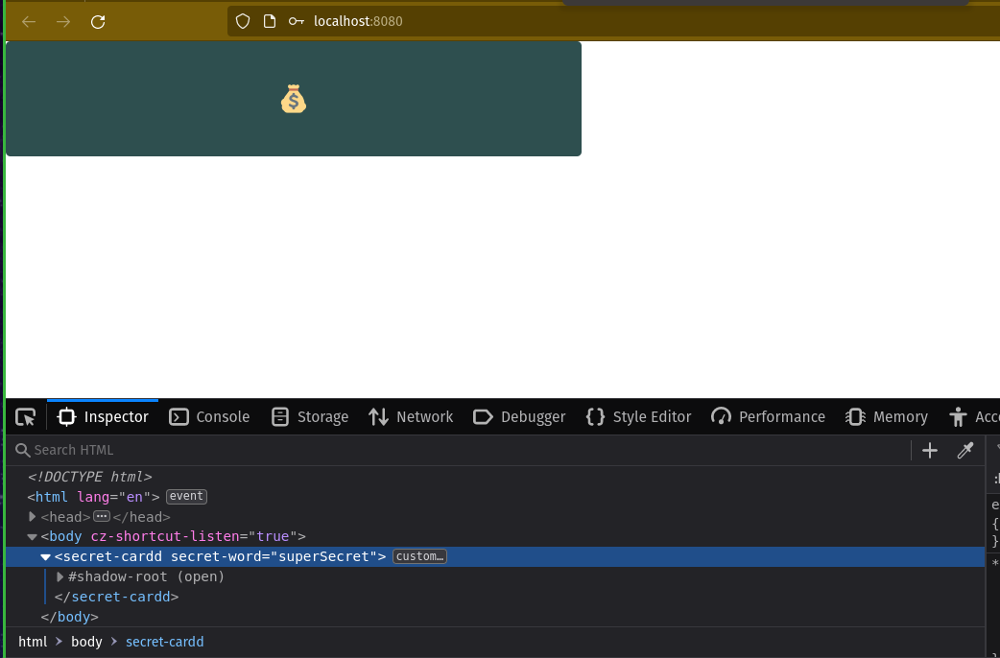
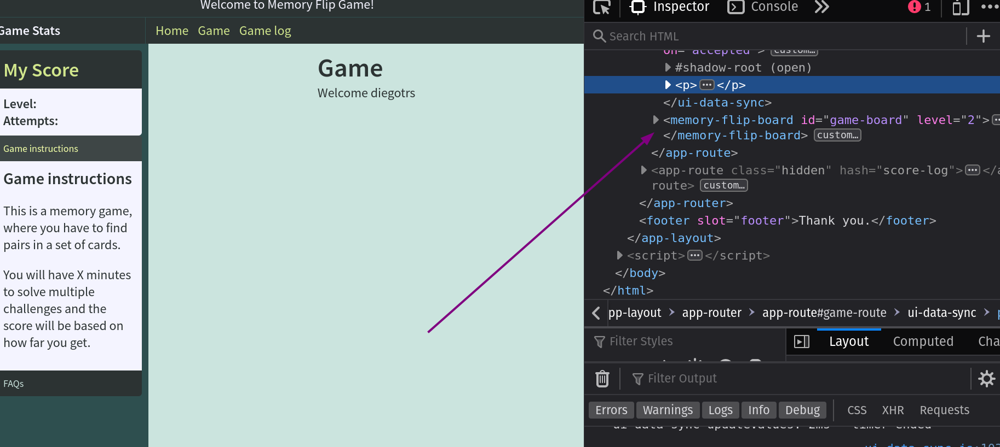
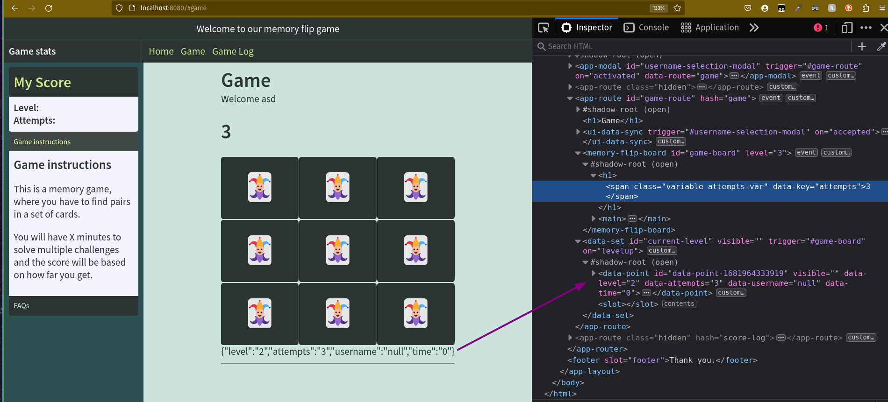

# SetUp
1. Open a terminal window and create a folder we will use for this lab. The name doesn't matter.
2. Now change directory into that folder.
3. Run the following command - `npx dwck project web-components-app` - and hit `y` when asked to confirm. This will deploy the project structure for our lab into this folder. 
4. Now change directory into the `web-components-app` folder and run `npm install -D`
5. Open the `web-components-app` folder in your code editor of choice.
6. Create an `index.html` file in the root of this folder, add the following contents and save:
```html
<!DOCTYPE html>
<html lang="en">
<head>
    <meta charset="UTF-8">
    <meta http-equiv="X-UA-Compatible" content="IE=edge">
    <meta name="viewport" content="width=device-width, initial-scale=1.0">
    <title>Document</title>
</head>
<body>
    
</body>
</html>
```
7. Finally, run `npm run serve`. This will open a browser with the contents of the `index.html` file you just created (which is actually an empty page).

**Note:** In Lessons 1 and 2, unless explicitly directed otherwise, we will be working in the `index.html` file we just created above.


# Lesson 1: Introduction to Web Components
In this lesson we are going to work with some pre-created components to get you familiar with how to use and interact with components. So lets get started!

## Section 1.1: Using our first components

### Activity 1.1.1: Add a flip card
Create a simple `flip-card` in your [index.html](../index.html) by adding the following line to the `<body>` section:
```html
<flip-card style="width: 500px;"></flip-card>
```
Now save your changes and refresh your browser. Congratulations, you have just added your first web component! Move your mouse over the flip card to interact with it. Also, feel free to adjust the width value if you want to play with the size of the flip card.

Now lets add content to our `flip-card` by using the `slot` attribute. Add the following to the `<flip-card>` section, save and refresh the browser page:
```html
...
  <section slot="front">
    <h1>This card holds a secret</h1>
    <small>The secret is on the other side </small>
  </section>

  <section slot="back">
    <p>Lorem ipsum dolor sit amet consectetur adipisicing elit. Culpa, blanditiis eius. Ea ipsum minus, amet commodi, delectus iure dolorem quasi doloribus cum facilis hic illum! Cupiditate est doloremque vero delectus.</p>
  </section>
...
```
Perfect! Now we have some content added! 

Additionally, lets prevent the card from flipping when we move our mouse over it by passing the `disable` attribute:
```html
<flip-card disabled style="width: 500px;">
...
</flip-card>
```


---


### Activity 1.1.2: Create a button and a modal
Lets build on this now by adding a `button` and a `modal` to our web page. 

For the modal content, we are going to use the slots `title` and `main`. (**Note**: at this stage the button and the modal are not connected. We will come to that later). Add the following `button` and `app-modal` html under the `<flip-card>` section of our index.html file, save and refresh our browser page:
```html
...
<button>open</button>

<app-modal>
   <h1 slot="title" >This is the new title</h1>
   <section slot="main" >
      <p>Add text here</p>
      <input type="text" name="alias">
   </section>
</app-modal>
```

Our click button should now appear on the page. Notice however that when you click it it does nothing. Lets change that so when we click on it our modal will appear. The idea here is that the `button`, when clicked, will emit a `click` event. We are going to listen for this event by using the `trigger` and `on` attributes in `app-modal`, which act as the listener for the click event.

The `trigger` attribute is the CSS query the `app-modal` component will be listening for.

The `on` attribute is the event type the `app-modal` component is listening for.

So lets update our `app-modal` definition to include `trigger` and `on` attributes as follows: 

```html
...
<app-modal trigger="button" on="click">
...
```

Now if you click on the button again, this time our modal should appear!


The issue with this however is, because we have specified `button` as the trigger for our modal, this modal will get triggered any time any button on the page is clicked. So lets see how to add more granularity to control what action each button triggers if we decide to add multiple buttons to our page. We'll accomplish this using the `id` attribute.

Update our `button` and `app-modal` component definitions as follows:
```html
...
<button id="open-modal-btn">open</button>

<app-modal trigger="#open-modal-btn" on="click">
...
```

However, if we want multiple different buttons to trigger the same action, we can accomplish this using data attributes as follows. Go ahead and try it:
```html
...
<button id="open-modal-btn" data-attribute="you can use data attributes too">open</button>
<button data-attribute >this one open the modal too</button>

<app-modal trigger="[data-attribute]" on="click">
...
```

### Activity 1.1.3: Connect the flip-card to the app-modal
First, lets connect our flip-card component to our app-modal component so when we click `accept` in our modal it will flip our flip-card! Update our `flip-card` definition as follows and try it out:
```html
...
<flip-card disabled trigger="app-modal" on="accepted"  style="width: 500px;">
  ...
</flip-card>
...
```

Now that thats working, we are going to demonstrate how to get the data sent in an event, and how to change a components `textContent` or an attribute, so add some text in the text box on our app-modal and click accept we should see our flip card update. 

Inside the back slot section, lets replace the `<p>..</p>` section with the following `ui-data-sync`. Don't forget to save and refresh the browser page:
```html
...
<flip-card disabled trigger="app-modal" on="accepted">
   ...
   <section slot="back">

     <!-- adding this ui-data-sync and listening to the accepted event from app-modal -->
     <ui-data-sync trigger="app-modal" on="accepted">
       <h1>Hello <span name="alias"></span></h1>
     </ui-data-sync>

...
```
Now when you click a button, enter some text in the text box, click `Accept` and see what happens!

**Note:** We are going to cover `ui-data-sync` in more detail later on the lab.


**Final Snippet**
If you have been following along so far, here is what your `index.html` should look like:
```html
<!DOCTYPE html>
<html lang="en">

<head>
  <meta charset="UTF-8">
  <meta http-equiv="X-UA-Compatible" content="IE=edge">
  <meta name="viewport" content="width=device-width, initial-scale=1.0">
  <title>Document</title>
</head>

<body>

  <flip-card disabled trigger="app-modal" on="accepted" style="width: 500px;">
    <section slot="front">
      <h1>This card holds a secret</h1>
      <small>The secret is on the other side </small>
    </section>

    <section slot="back">
      
      <ui-data-sync trigger="app-modal" on="accepted">
        <h1>Hello <span name="alias"></span></h1>
      </ui-data-sync>

    </section>
  </flip-card>

  <button id="open-modal-btn" data-attribute="you can use data attributes too">open</button>
  <button data-attribute >this one open the modal too</button>
  
  <app-modal trigger="[data-attribute]" on="click">
    <h1 slot="title">This is the new title</h1>
    <section slot="main">
      <p>Add html here =)</p>
      <input type="text" name="alias">
    </section>
  </app-modal>

</body>

</html>
```


---


## Section 1.2: Creating our first web component
In this section we are going to create a component we will call our `secret-card` component. This component will be like our flip-card component, however it will be password protected, so in order to see what is on the other side of the card the user will need to provide an accepted password.

### Activity 1.2.1: Create required files
To get started we will need to create some new files and folders. Inside the `src/components` folder create an `index.js` which will be the index for all components created in this lab. And add the following `export` statement to it:
  ```js
  export * from './secret-card'
  ```
Next, create a folder called `src/components/secret-card` and create the following files inside it:
- `index.js` - This will be the access point to our component. Add the following `export` statement to it:
  ```js
  export * from './secret-card'
  ```
- `secret-card.js` - Here we will define our component and its functionality
- `secret-card.html` - Here we will copy and pasted what we did in the previous section
- `secret-card.css` - Any extra style for this component can be added here


When finished, your folder structure should look like this:

- `web-components-app`:
  - `src`:
    - `components`:
      - index.js
      - `secret-card`:
        - index.js
        - secret-card.css
        - secret-card.html
        - secret-card.js

Finally, add the following line to `./src/index.js`:
  ```js
  export * from './components/secret-card'
  ```

Now that our file and folder structure is ready, copy all the HTML inside the `body` tags from our `index.html` from session 1 and paste it into `secret-card.html`. Do not including the `body`, `html` or `header` tags themselves. Save the file.

When we are finished, our `secret-card.html` should look like this:
```html
<!-- this is the html we are moving from index to secret-card.js -->
<flip-card disabled trigger="app-modal" on="accepted" style="width: 500px;">
  <section slot="front">
    <h1>This card holds a secret</h1>
    <small>The secret is on the other side </small>
  </section>

  <section slot="back">
    
    <ui-data-sync trigger="app-modal" on="accepted">
      <h1>Hello <span name="alias"></span></h1>
    </ui-data-sync>

  </section>
</flip-card>

<button id="open-modal-btn" data-attribute="you can use data attributes too">open</button>
<button data-attribute >this one open the modal too</button>

<app-modal trigger="[data-attribute]" on="click">
  <h1 slot="title">Provide a secret</h1>
  <section slot="main">
    <input type="text" name="alias">
  </section>
</app-modal>
```


### Activity 1.2.2: Create SecretCardComponent class
In `secret-card.js` we will now provide the component definition and it's functionality.

First we want to import some dependencies. Add the following lines to import the `html` stored in  `./web-components-app/src/lib/web-tools.js` and create a class named `SecretCardComponent`. This class will extend the native `HTMLElement` class:
  ```js
  import { html } from '../../lib/web-tools'

  export default class SecretCardComponent extends HTMLElement {
    constructor() {
      super()
    }
  }
  ```

Also add the following two import statements to import any HTML and CSS from our newly created secret-card fHTML and CSS files:
  ```js
  ...  
  import componentStyle from './secret-card.css'
  import componentHtml from './secret-card.html'
  ...
  ```

Let's use the imported assets in our component by creating a template and attaching it to the shadow root of the component. We will achieve this by adding the following lines to our `SecretCardComponent` class:
  ```js
      const template = html`
        <style>${componentStyle}</style>
        ${componentHtml}
      `

      // add this to create a new shadow rood for your component, 
      // so you can isolate the internal and external styles and html
      this.attachShadow({ mode: 'open' })
      this.shadowRoot.appendChild(template)
  ```

Finally, register the web component on the browser by calling:
  ```js
  // here we are registering our component on the browser
  // first argument is how you will use the tag <secret-card>
  window.customElements.define('secret-card', SecretCardComponent)
  ```

When finished, our `secret-card.js` should look like this:
```js
  import { html } from '../../lib/web-tools'
  import componentStyle from './secret-card.css'
  import componentHtml from './secret-card.html'

  export default class SecretCardComponent extends HTMLElement {

    constructor() {
      super()
      const template = html`
        <style>${componentStyle}</style>
        ${componentHtml}
      `
       this.attachShadow({ mode: 'open' })
       this.shadowRoot.appendChild(template)
    }

  }

  // here we are registering our component on the browser
  // first argument is how you will use the tag <secret-card>
  window.customElements.define('secret-card', SecretCardComponent)

```

Save our updates and let's now we go back to our `index.html` from session 1 and try out the the new component we just created by replacing the previous body content (everything with the body tags) with this single line:
```html
  <secret-card></secret-card>
```
Save your changes.  

The web page should look exactly the same, however if you click either of the buttons you will notice they no longer work. This is because we are now in the context of inside a web component. 


### Activity 1.2.3: Get interactive elements from `secret-card.js`
Lets first clean up the HTML in our `secret-card.html` a little. Since we are going to use JavaScript to handle events, lets remove all `trigger` and `on` attributes, and lets also delete the buttons we created before. Additionally, for the back of the card, lets replace the `ui-data-sync` and its content with our secret. In our example below we are adding a 💰 favicon as our secret, but you can add whatever you want. Finally, lets update out `app-modal`. Update the title for something more meaningful such as "Enter password", and we can remove the `<p>..</p>` line completely.
Our `secret-card.html` should now look something like this:
```html
<flip-card disabled style="width: 500px;">
    <section slot="front">
      <h1>This card holds a secret</h1>
      <small>The secret is on the other side </small>
    </section>
  
    <section slot="back">
      <!-- add your secret here -->
      <h1>💰</h1>
    </section>
  </flip-card>
  
  <app-modal>
    <h1 slot="title">Enter password</h1>
    <section slot="main">
      <input type="text" name="alias">
    </section>
  </app-modal>
```


Now we want to select and store a reference for the `flip-card` and `app-modal` elements. Lets do this by adding the following two small chunks of code to our `secret-card.js`:
```js
...
export default class SecretCardComponent extends HTMLElement {

   // 1. Private variables to store a reference to flip-card and modal
   #flipCard
   #modal
   //

   constructor() {
      super()
      const template = html`
         <style>${componentStyle}</style>
         ${componentHtml}
      `
      this.attachShadow({ mode: 'open' })
      this.shadowRoot.appendChild(template)

      // 2. Selecting elements from shadow dom
      this.#flipCard = this.shadowRoot.querySelector('flip-card')
      this.#modal = this.shadowRoot.querySelector('app-modal')
      //

   }

}
...
```

Now we are going to listen to the `click` event on the `flip-card`. When this event is detected is should open the modal and ask the user to enter a password. So add the following code to the end of the `SecretCardComponent` constructor: 
```js
...
// when flip card is clicked, show the modal
this.#flipCard.addEventListener('click', event => this.#modal.show())

this.#modal.addEventListener('accepted', event => {
   console.log(event) // data is located on event.detail
})
...
```

Finally, for completeness, in `secret-card.html`, let's change the input type from `name` to `password`:
```html
...
    <input type="password" name="secret">
...
```

Save all changes and go ahead and test them out. When we click on the flip card we should now see our modal pop up and ask us to enter a password which will be star'd out so it is not visible to the user.


### Activity 1.2.4: Get a value from an attribute
So at this point we have defined our secret (💰) on the back side of our flip card and enabled the password protection on the flip card via the modal. The last thing we need to do now is set a password and configure our modal component to verify the password provided in the modal against that password. Lets add a new property called `password` to the `secret-card` component. This is where we will set the password that the modal will validate against. 

In `index.html`, let's add this property (**Note** You can add whatever string you want for the password):
```html
  <secret-card password="mypassword"></secret-card>
```


Now, let's use this value inside the `secret-card.js` file and save our changes:
```js
...
this.#modal.addEventListener('accepted', event => {
  console.log(event)

  // here we are getting the data from the event (secret will be inside)
  const { secret } = event.detail

  // here we are reading the attribute value passed on index.html
  if (secret === thi?s.getAttribute('password'))
      this.#flipCard?.flip()

})
```

So far this is what we have:
`src/components/secret-card.js`
```js
import { html } from '../../lib/web-tools'

import componentStyle from './secret-card.css'
import componentHtml from './secret-card.html'

export default class SecretCarddComponent extends HTMLElement {

  #flipCard
  #modal

  constructor() {
    super()

    const template = html`
      <style>${componentStyle}</style>
      ${componentHtml}
    `

    this.attachShadow({ mode: 'open' })
    this.shadowRoot.appendChild(template)

    this.#flipCard = this.shadowRoot.querySelector('flip-card')
    this.#modal = this.shadowRoot.querySelector('app-modal')

    this.#flipCard.addEventListener('click', event => this.#modal.show())

    this.#modal.addEventListener('accepted', event => {
      console.log(event) // data is located on event.detail

      // here we are getting the data from the event (secret will be inside)
      const { secret } = event.detail

      // here we are reading the attrivute value passed on index.html
      if (secret === t?his.getAttribute('password'))
        this.#flipCard?.flip()

    })

  }
}
// console.log('registering this card')
window.customElements.define('secret-cardd', SecretCarddComponent)
```

`src/components/secret-card.html`
```html
<flip-card disabled style="width: 500px;">
<section slot="front">
    <h1>This card holds a secret</h1>
    <small>The secret is on the other side </small>
</section>

<section slot="back">
    <!-- add your flavor here -->
    <h1>💰</h1>
</section>
</flip-card>

<app-modal>
<h1 slot="title">Do you want to know the secret?</h1>
<section slot="main">
    <p>First, let us know the password</p>
    <input type="password" name="secret">
</section>
</app-modal>
```

`index.html`
```html
<!DOCTYPE html>
<html lang="en">

<head>
  <meta charset="UTF-8">
  <meta http-equiv="X-UA-Compatible" content="IE=edge">
  <meta name="viewport" content="width=device-width, initial-scale=1.0">
  <title>Document</title>
</head>

<body>

  <secret-card password="superSecret"></secret-card>

</body>

</html>
```


Now, lets go to the browser. If we refresh it, we should be able to provide our password to the modal, click `Accept` and the flipcard should reveal its content!




### Activity 1.2.5: Implement the `trigger` and `on` attributes
Let's enable this component to listen to events from other components by using the `trigger` and `on` attributes.
In order to achieve this, we are going to be using the `registerTriggers` helper function from `web-components-app/src/lib/web-tools.js`. Feel free to explore the source code for this function and any other component used on this workshop.
First, let's import `registerTriggers` in `src/components/secret-card.js` by updating our `import { html }..` line to include `registerTriggers` as shown here:
```js
// this is a set of global tools to simplify development
import { html, registerTriggers } from '../../lib/web-tools'
...
```

Our goal is to register event listeners when the component is mounted on the DOM.
Then call the `registerTriggers` function which, internally, will get all the elements that match the [css selector](https://developer.mozilla.org/en-US/docs/Web/CSS/CSS_Selectors). Then register a listener for the event specified in the `on` attribute.
We only need to pass a callback function to handle those events.
Here we are using the [connectedCallback](link to doc) life cycle event. This will be called when the component is mounted on the DOM.

So add the following to the end of the `SecretCardComponent`:
```js
  ...
  // this is one of multiple lifecycle callbacks we have for web components
  connectedCallback() {
    registerTriggers(this, () => this.#modal.show())
  }

```

Finally, let's test it in `index.html` by adding a button and configuring `trigger` and `on` attributes in the secret card:
```html
...
<body>

  <button id="reveal-btn">reveal secret</button>
  
  <secret-card trigger="#reveal-btn" on="click" password="mypassword"></secret-card>
  
</body>
...
```

<Add a line or two to recap what has be show>


---


# Lesson 2: Composing apps with Web Components

In this Lesson, we are going to create an amazing game using only web components, some provided by the lab, some that we are about to create.

here is a sample of our end goal:


## Section 2.1: Layout components

Before we begin, lets start with a brand new `index.html`
lets delete everything we added inside the `body` tag.
your `index.html` should look like this:
```html
<!DOCTYPE html>
<html lang="en">

<head>
  <meta charset="UTF-8">
  <meta http-equiv="X-UA-Cod1hhmpatible" content="IE=edge">
  <meta name="viewport" content="width=device-width, initial-scale=1.0">
  <title>Document</title>
</head>

<body>


</body>

</html>
```

### Activity 2.1.1: App layout

Inside the `body` tag on `index.html` lets use the `app-layout` tag to create an empty application layout 
The slot name will be displayed in the browser:
```html
   <app-layout></app-layout>
```

By using this tag, we should be able to see in the browser, an empty shell for a web application, the names you see in each section is the name of the corresponding slot.


Let's fill the `header`, `left-header`, `left-menu`, `top-menu` and `footer` slots. Here we are adding some titles and a navigation bar on top with 3 routes:
```html
  <style>
    nav a {
      color: var(--main-tone);
      padding: 2px 4px;
    }
  </style>
  <app-layout>
    <header slot="header">Welcome to our memory flip game</header>
    <b slot="left-header">Game stats</b>

    <nav slot="top-menu" class="">
      <a href="#">Home</a>
      <a href="#game">Game</a>
      <a href="#leaderboard">Leaderboard</a>
    </nav>

    <footer slot="footer">Thank you.</footer>
  </app-layout>
```

Now, on the left-content, lets add some components - a `plain-card` on top and an `app-accordion` below:  
```html
   ...
    </nav>

    <section slot="left-content">
      <plain-card></plain-card>
      <app-accordion></app-accordion>
    </section>

    <footer slot="foother">Thank you.</footer>
    ...
```

There are 2 slots in `plain-card` - `title` to add text to upper bar, and `main` to add the content of the card.
Let's add some placeholders for the score:
```html
  <plain-card>
     <h2 slot="title">My Score</h2>
     <section slot="main">
        <div>
          <b>Level:</b><span data-key="level"></span><br>
          <b>Attempts:</b><span data-key="attempts"></span><br>
          <b>Username:</b><span data-key="username"></span><br>
        </div>
     </section>
   </plain-card>
```

For the accordion, we only use one slot, so it's not require to specify the slot attribute. Everything passed to this component will be added inside the accordion.
Every item on the accordion should be wrapped on a tag, like `section`, `article` or `div`. Also, the first item should be a <h*> like `h1`, `h2` and so on. This will be adopted as the title on the accordion tab.
Here let's add the instructions for our game:
```html
   <app-accordion>
      <section>
       <h5>Game instructions</h5>
       <p>This is a memory game, where you have to find pairs in a set of cards.</p>
       <p>You will have X minutes to solve multiple challenges and the score will be based on how far you get.</p>
      </section>
      <section>
       <h5>FAQs</h5>
       <b>Question 1:</b>
       <p>Answer 1</p>
       <hr>
       <b>Question 2:</b>
       <p>Answer 2</p>
       <hr>
      </section>
   </app-accordion>
```

So far, this is our `index.html`
```html
<!DOCTYPE html>
<html lang="en">

<head>
  <meta charset="UTF-8">
  <meta http-equiv="X-UA-Cod1hhmpatible" content="IE=edge">
  <meta name="viewport" content="width=device-width, initial-scale=1.0">
  <title>Document</title>
</head>

<body>

  <style>
    nav a {
      color: var(--main-tone);
      padding: 2px 4px;
    }
  </style>
  <app-layout>
    <header slot="header">Welcome to our memory flip game</header>
    <b slot="left-header">Game stats</b>

    <nav slot="top-menu" class="">
      <a href="#">Home</a>
      <a href="#game">Game</a>
      <a href="#leaderboard">Leaderboard</a>
    </nav>

    <section slot="left-content">
      <plain-card>
        <h2 slot="title">My Score</h2>
        <section slot="main">
          <div>
            <b>Level:</b><span data-key="level"></span><br>
            <b>Attempts:</b><span data-key="attempts"></span><br>
            <b>Username:</b><span data-key="username"></span><br>
          </div>
        </section>
      </plain-card>

      <app-accordion>
        <section>
          <h5>Game instructions</h5>
          <p>This is a memory game, where you have to find pairs in a set of cards.</p>
          <p>You will have X minutes to solve multiple challenges and the score will be based on how far you get.</p>
        </section>
        <section>
          <h5>FAQs</h5>
          <b>Question 1:</b>
          <p>Answer 1</p>
          <hr>
          <b>Question 2:</b>
          <p>Answer 2</p>
          <hr>
        </section>
      </app-accordion>

    </section>

    <footer slot="footer">Thank you.</footer>
  </app-layout>


</body>

</html>
```

And this is how it should look on the browser


So, the `main` slot is the last one to fill, but before doing it, let's talk about routing.


### Activity 2.1.2: Hash routing
In the previous Lesson we added 3 links at the top of the page - `home`, `game` and `leaderboard`.
In order to handle them we'll make use of hash routing. In other words, we will display different content with different hashes (#users, #orders and so on) of the url. https://subdomain.domain.tld/route#hash.

To detect and handle these hash changes, we have the `app-router` and `app-route` components.
The first one, `app-router`, is the parent element, and is the one that listens for changes in the url and allows the child `app-route` to activate or not.

Lets add an `app-router` as the main slot:
```html
  ...
         </section>
      </app-accordion>
    </section>

    <app-router slot="main">
      <!-- routes will be here -->
    </app-router>

    <footer slot="footer">Thank you.</footer>
  ...
```

For each individual route, we will use an `app-route`.
This component has the attribute `hash="<hash_rotue>"` to specify when it should be displayed or not.
For the default route, don't specify the `hash` attribute.

Let's add `app-route` for the 3 routes we have:
```html
  ...
   <app-router slot="main">

      <app-route>I'm Home</app-route>
      <app-route hash="game" >I'm Game</app-route>
      <app-route hash="leaderboard" >I'm Leaderboard</app-route>

   </app-router>
  ...
```

This router componet is adding the class `.hidden`
```css
    .hidden {
      display: none;
    }
```

Now, if you test in your browser, you should be able to navigate and see page changes on your app. Note the hash part on the url match the route you are seeing.


`app-router` emits a `navigated` event when there is a change in the url and it will activate the proper `app-route`.
This `app-route`, when the hash is matched, it will display its content and it will emit the `activated` event.

Let's see this in action by adding an `app-modal` that asks for a username every time we navigate to the `Game` page.
fFrst, let's add an `id` attribute to the game route:
```html
  <app-route id="game-route" hash="game">
```
Then let's add an `app-modal` and set the `trigger` and the `on` attributes:
```html
  ...
   <app-router slot="main">

      <!-- add this modal before all the app-route elements -->
      <app-modal id="username-selection-modal" trigger="#game-route" on="activated">
        <h1 slot="title">Start a new match</h1>
        <section slot="main">
          <p>Ready to start a new match?</p>
          <p>Choose a username and let's play</p>
          <form>
            <label>Username:</label><input type="text" name="username">
          </form>
        </section>
      </app-modal>
  
      <app-route>
  ...
```

On the game route, let's reflect the username.
Let's add an `ui-data-sync` to get the `username` input from `app-modal` and place it inside a `span` tag. 
**Note:** The input name must match the data-key attribute on the desired target element.

```html
   ...
   <app-route id="game-route" hash="game">
     <h1>I'm Game</h1>
     <ui-data-sync trigger="#username-selection-modal" on="accepted" >
       <p>Welcome <span data-key="username"></span></p>
     </ui-data-sync>
   </app-route>
   ...
```

And lastly, lets log every route change in the console.
```html
   ...
   </app-modal>

      <script>
        document
          .querySelector('app-router')
          .addEventListener('navigated', event =>
            console.log(`navigated to ${event.detail.hash || 'home'}`))
      </script>

      <app-route>
   ...
```

This is how our `index.html` should looks:
```html
<!DOCTYPE html>
<html lang="en">

<head>
  <meta charset="UTF-8">
  <meta http-equiv="X-UA-Cod1hhmpatible" content="IE=edge">
  <meta name="viewport" content="width=device-width, initial-scale=1.0">
  <title>Document</title>
</head>

<body>

  <style>
    /* this class is to hide routes */
    .hidden {
      display: none;
    }

    nav a {
      color: var(--main-tone);
      padding: 2px 4px;
    }
  </style>
  <app-layout>
    <header slot="header">Welcome to our memory flip game</header>
    <b slot="left-header">Game stats</b>

    <nav slot="top-menu" class="">
      <a href="#">Home</a>
      <a href="#game">Game</a>
      <a href="#leaderboard">Leaderboard</a>
    </nav>

    <section slot="left-content">
      <plain-card>
        <h2 slot="title">My Score</h2>
        <section slot="main">
          <div>
            <b>Level:</b><span data-key="level"></span><br>
            <b>Attempts:</b><span data-key="attempts"></span><br>
            <b>Username:</b><span data-key="username"></span><br>
          </div>
        </section>
      </plain-card>

      <app-accordion>
        <section>
          <h5>Game instructions</h5>
          <p>This is a memory game, where you have to find pairs in a set of cards.</p>
          <p>You will have X minutes to solve multiple challenges and the score will be based on how far you get.</p>
        </section>
        <section>
          <h5>FAQs</h5>
          <b>Question 1:</b>
          <p>Answer 1</p>
          <hr>
          <b>Question 2:</b>
          <p>Answer 2</p>
          <hr>
        </section>
      </app-accordion>
    </section>

    <app-router slot="main">

      <app-modal id="username-selection-modal" trigger="#game-route" on="activated">
        <h1 slot="title">Start a new match</h1>
        <section slot="main">
          <p>Ready to start a new match?</p>
          <p>Choose a username and let's play</p>
          <form>
            <label>Username:</label><input type="text" name="username">
          </form>
        </section>
      </app-modal>

      <app-route>home</app-route>

      <app-route id="game-route" hash="game">
        <h1>I'm Game</h1>
        <ui-data-sync trigger="#username-selection-modal" on="accepted">
          <p>Welcome <span data-key="username"></span></p>
        </ui-data-sync>
      </app-route>
      
      <app-route hash="leaderboard">Leaderboard</app-route>
    
    </app-router>

    <footer slot="footer">Thank you.</footer>
  </app-layout>


</body>

</html>
```


And on the broswer:


### Activity 2.1.3: Grid layout
on `web-components-app/src/components` create the `grid-layout` folder
then create the `index.js` on `web-components-app/src/components/grid-layout` with the following content:
```js
  export * from './grid-layout'
```
then lets create `grid-layout.js` on the same folder and let's initialize an emtpy component
```js
   import { html, registerTriggers } from '../../lib/web-tools'

   export default class GridLayoutComponent extends HTMLElement {

     constructor() {
       super()
       const template = html``
       this.attachShadow({ mode: 'open' })
       this.shadowRoot.appendChild(template)
     }

     connectedCallback() {
       registerTriggers(this, (event) => console.log(event))
     }

   }

   window.customElements.define('grid-layout', GridLayoutComponent)
```

And now lets add this new component on `src/components/index.js`
```js 
export * from './secret-card' // this is the one we already have

export * from './grid-layout' // add this one
```


Now, in order to render the content that is passed between the `<grid-layout>this content </grid-layout>` we need to use a `slot` tag.
Because for our use case, this component will only have one slot, there is no need to specify the slot name when consuming this `grid-layout`

lets go back to the constructor function and add the slot tag
```js
// replace this...
const template = html``

// for this...
const template = html`
  <style>
    /* here we will add some styles on the next step */      
  </style>
  <div id="grid-container">
    <slot></slot>
  </div>
`
```

Now that we added the string template for our html, lets add some css to enable the grid.

**Note:** _because we are using a template string from javascript, we will be getting some values dinamycally from js, this will only work on first load, if the value of the grid change we won't react to that change, we will cover those changes later on the lab_

On the `style` tag lets add the css for a grid layout
```css
#grid-container {
   display: grid;
   grid-template-columns: repeat(${this.getAttribute('columns')}, 1fr);
   grid-template-rows: repeat(${this.getAttribute('rows')}, 1fr);
   grid-gap: ${ this.getAttribute('gap') || '20px'};
}
```


This will be enogh to test our component,  no grid so far.
On `index.html` lets add the following snippet on the `#game` route:

```html
   <grid-layout gap="1px" columns="2" rows="2">
    <flip-card></flip-card>
    <flip-card></flip-card>
    <flip-card></flip-card>
    <flip-card></flip-card>
   </grid-layout>
```


This is the full `grid-layout.js`:
```js
import { html, registerTriggers } from '../../lib/web-tools'

export default class GridLayoutComponent2 extends HTMLElement {

  constructor() {
    super()
    const template = html`
      <style>
        #grid-container {
          display: grid;
          grid-template-columns: repeat(${this.getAttribute('columns')}, 1fr);
          grid-template-rows: repeat(${this.getAttribute('rows')}, 1fr);
          grid-gap: ${ this.getAttribute('gap') || '20px'};
        }
      </style>

      <div id="grid-container">
        <slot></slot>
      </div>
    `
    this.attachShadow({ mode: 'open' })
    this.shadowRoot.appendChild(template)
  }

  connectedCallback() {
    registerTriggers(this, (event) => console.log(event))
  }

}

window.customElements.define('grid-layout-2', GridLayoutComponent2)
```

and the full `index.html`:
```html
<!DOCTYPE html>
<html lang="en">

<head>
  <meta charset="UTF-8">
  <meta http-equiv="X-UA-Cod1hhmpatible" content="IE=edge">
  <meta name="viewport" content="width=device-width, initial-scale=1.0">
  <title>Document</title>
</head>

<body>

  <style>
    /* this class is to hide routes */
    .hidden {
      display: none;
    }

    nav a {
      color: var(--main-tone);
      padding: 2px 4px;
    }
  </style>
  <app-layout>
    <header slot="header">Welcome to our memory flip game</header>
    <b slot="left-header">Game stats</b>

    <nav slot="top-menu" class="">
      <a href="#">Home</a>
      <a href="#game">Game</a>
      <a href="#leaderboard">Leaderboard</a>
    </nav>

    <section slot="left-content">
      <plain-card>
        <h2 slot="title">My Score</h2>
        <section slot="main">
          <div>
            <b>Level:</b><span data-key="level"></span><br>
            <b>Attempts:</b><span data-key="attempts"></span><br>
            <b>Username:</b><span data-key="username"></span><br>
          </div>
        </section>
      </plain-card>

      <app-accordion>
        <section>
          <h5>Game instructions</h5>
          <p>This is a memory game, where you have to find pairs in a set of cards.</p>
          <p>You will have X minutes to solve multiple challenges and the score will be based on how far you get.</p>
        </section>
        <section>
          <h5>FAQs</h5>
          <b>Question 1:</b>
          <p>Answer 1</p>
          <hr>
          <b>Question 2:</b>
          <p>Answer 2</p>
          <hr>
        </section>
      </app-accordion>
    </section>

    <app-router slot="main">

      <app-modal id="username-selection-modal" trigger="#game-route" on="activated">
        <h1 slot="title">Start a new match</h1>
        <section slot="main">
          <p>Ready to start a new match?</p>
          <p>Choose a username and let's play</p>
          <form>
            <label>Username:</label><input type="text" name="username">
          </form>
        </section>
      </app-modal>

      <app-route>home

        <grid-layout-2 gap="1px" columns="2" rows="2">
          <flip-card></flip-card>
          <flip-card></flip-card>
          <flip-card></flip-card>
          <flip-card></flip-card>
        </grid-layout-2>

      </app-route>

      <app-route id="game-route" hash="game">
        <h1>I'm Game</h1>
        <ui-data-sync trigger="#username-selection-modal" on="accepted">
          <p>Welcome <span data-key="username"></span></p>
        </ui-data-sync>
      </app-route>
      
      <app-route hash="leaderboard">Leaderboard</app-route>
    
    </app-router>

    <footer slot="footer">Thank you.</footer>
  </app-layout>


</body>

</html>
```

And we should see a 2 by 2 grid of flip cards


## Section 2.2: Creating a statefull component

### Activity 2.2.1: Memory flip game

Here, we want to create a component that will draw the boar for our memory game.
This componente will be used in this way, and every time we change the level attribute we want to update the component to reflect the new level.
```html
<memory-flip-board id="game-board" level="2"></memory-flip-board>
```

At this point, we are familiar with the process, create a `memory-flip-board` folder on `web-components-app/src/components`. And create the respective `index.js` file to export the component
```js
  export * from './memory-flip-board'
```

We also need to update `web-components-app/src/components/index.js`.
At this point it should look like this:
```js
   export * from './secret-card'
   export * from './grid-layout'
   export * from './memory-flip-board' // add this line
```

Before the `export class ...` lets add an array full of emojist, they will be used as the images on our memory game:
```js
...
// add this after the impors ...
const emojiList = [
  '🍏', '🍎', '🍐', '🍊', '🍋', '🍌', '🍉', '🍇', '🍓', '🫐', '🍈', '🍒',
  '🍑', '🥭', '🍍', '🥥', '🥝', '🍅', '🍆', '🥑', '🥦', '🌭', '🍔', '🍟',
  '🍕', '🌮', '🍧', '🍦', '🥧', '⚽', '🏀', '🏈', '⚾', '🥎', '🏐', '🏉',
  '🎱', '🏓', '🏸', '🏒', '🥅', '⛳', '🏹', '🎣', '🥊', '🥋', '🛹', '🛷',
  '⛸️', '🏂', '🎤', '🎼', '🎹', '🪘', '🥁', '🎷', '🎺', '🪗', '🎸', '🎻',
]

const trapEmoji = '🔥🔥🔥' // this will be used when odd number of cards are present
...
```

Now create `memory-flip-board.js` on `web-components-app/src/components/memory-flip-board` with an empty web component:
```js
import { 
  html, 
  registerTriggers, 
  getRandomInt, 
  getRandomItem, 
  updateVars 
} from '../../lib/web-tools'

export default class MemoriFlipBoardComponent extends HTMLElement {
  constructor() {
    super()
    const template = html`<main></main>`
    this.attachShadow({ mode: 'open' })
    this.shadowRoot.appendChild(template)
  }

}

window.customElements.define('memory-flip-board', MemoriFlipBoardComponent)
```

Now, in order to detect changes on the `level` attribute, we will use the [lifecycle callbacks](https://developer.mozilla.org/en-US/docs/Web/Web_Components/Using_custom_elements#using_the_lifecycle_callbacks) api provided by the Web components standar.

In this case, we will use the `attributeChangedCallback` to detect changes on some attributes. Wich attribute you might be asking...
Well the ones we tell JavaScript to observe.
On `memory-flip-board.js` lets add a static property to our class:
```js
  ...
  // add this before class constructor
  static get observedAttributes() {
    return ['level', 'time', 'preview']
  }
  ...
```

and lets add the `attributeChangedCallback` method after the constructor and let add a `generateComponents` method after that. Every time the attribute change we want to call the `generateComponents` method
```js
  // name is the name of the attribute that changed
  // oldValue represent the previous value
  // new value represents the current value for the attribute
  attributeChangedCallback(name, oldValue, newValue) {
    if (name !== 'level') return // we are only interested on the level attribute
    console.log(name, oldValue, newValue) // lets explore this values

     this.generateComponents()
  }

  generateComponents() {
    console.log(`generating components`)
    // we will add more code here later
  }
  
```

on `index.html` lets replace the old `grid-layout` for the new `memory-flip-board`
```html
<!-- replace this -->
<grid-layout gap="1px" columns="2" rows="2">
   <flip-card></flip-card>
   <flip-card></flip-card>
   <flip-card></flip-card>
   <flip-card></flip-card>
</grid-layout>

<!-- for this -->
<memory-flip-board id="game-board" level="2"></memory-flip-board>
```

Now, if go to the browser, navigate to `#game` page and inspect the html, we should see our `memory-flip-board`:


lets go ahead and double click on the level attribute and lets change the value to `3`, we should se the console log with the new value:


### Activity 2.2.2: Generating content dynamically

Because the value of the attribute `level` is very important, and it will be used many times, lets create a [getter property](https://developer.mozilla.org/en-US/docs/Web/JavaScript/Reference/Functions/get#using_getters_in_classes) to avoid writing `this.getAttribute('level')` and having to convert this value from string to number. This will be done before the constructor:
```js
  ...
  get level() {
    const level = Number(this.getAttribute('level'))
    return Number.isNaN(level) ? 2 : level // if level is not a number, set a defaul value of 2
  }
  ...
```

The way we will access this is by simply calling `this.level` as a regular property. We will see an example soon.


Now that we see that change is detected, lets go ahead and implement the `drawGridElements` private method:
```js
...
  #drawGridElements() {

    // 1. get the main tag from this component and empty it
    const gridContainer = this.shadowRoot.querySelector('main')
    gridContainer.innerHTML = ''

    // 2. let see how many pairs can we fit according to the level
    const pairCount = Math.floor((this.level * this.level) / 2)

    // 3. lets create an empty array to hold all the emojis that will be used this round
    const pairArray = []

    // 4. lets randomly select elements from the
    for (let pairIndex = 0; pairIndex < pairCount; pairIndex++) {
      const emoji = emojiList.splice(getRandomInt(0, emojiList.length), 1).pop()

      pairArray.push(emoji)// adding the emoji at the end of the array
      pairArray.unshift(emoji) // and at the begining, we want 2 cards with the same emoji
    }

    // 5. if level is odd, lets add a trap card, add the trap emoji to the list
    const hasTrap = this.level % 2 === 1
    if (hasTrap) pairArray.push(trapEmoji)

    // 6. lets create the grid-layout that will hold the flip cards
    const grid = html`
     <grid-layout gap="1px" columns="${this.level}" rows="${this.level}">
     </grid-layout>
   `

    // 7. we got all we need, lets loop and print
    for (let colIndex = 1; colIndex <= this.level; colIndex++) {
      for (let rowIndex = 1; rowIndex <= this.level; rowIndex++) {

        let pairEmoji = getRandomItem(pairArray) // getting a random emoji from array
        // if (!pairEmoji) pairEmoji
        const id = `flip-${rowIndex + ((colIndex - 1) * this.level)}`
        const flip = html`
              <flip-card disabled id="${id}" data-pair-id="${pairEmoji}">
                <span slot="front" style="font-size: 3em; user-select: none;">🃏</span>
                <span slot="back" style="font-size: 3em; user-select: none;">${pairEmoji}</span>
              </flip-card>
          `
        // console.log(flip)
        grid.firstChild.appendChild(flip)
        this.#flipMap.set(id, false)
      }
    }

    // 9. last, lets append the grid to the main tag of this component
    this.shadowRoot.querySelector('main').appendChild(grid)

  }
...
```

And lets call this method inside `generateComponents`
```js
  ...
  generateComponents() {
    console.log(`generating components`)
    this.#drawGridElements()
  }
  ...
```

so far, our component code should look similar to this:
`memory-flip-board.js`
```js
import {
  html,
  registerTriggers,
  getRandomInt,
  getRandomItem,
  updateVars
} from '../../lib/web-tools'
const emojiList = [
  '🍏', '🍎', '🍐', '🍊', '🍋', '🍌', '🍉', '🍇', '🍓', '🫐', '🍈', '🍒',
  '🍑', '🥭', '🍍', '🥥', '🥝', '🍅', '🍆', '🥑', '🥦', '🌭', '🍔', '🍟',
  '🍕', '🌮', '🍧', '🍦', '🥧', '⚽', '🏀', '🏈', '⚾', '🥎', '🏐', '🏉',
  '🎱', '🏓', '🏸', '🏒', '🥅', '⛳', '🏹', '🎣', '🥊', '🥋', '🛹', '🛷',
  '⛸️', '🏂', '🎤', '🎼', '🎹', '🪘', '🥁', '🎷', '🎺', '🪗', '🎸', '🎻',
]

const trapEmoji = '🔥🔥🔥' // this will be used when odd number of cards are present

export default class MemoriFlipBoardComponent2 extends HTMLElement {

  static get observedAttributes() {
    return ['level', 'time', 'preview']
  }

  get level() {
    const level = Number(this.getAttribute('level'))
    return Number.isNaN(level) ? 2 : level
  }

  attempts = 0
  #waiting
  #currentCard

  constructor() {
    super()
    const template = html`<main></main>`
    this.attachShadow({ mode: 'open' })
    this.shadowRoot.appendChild(template)

  }

  attributeChangedCallback(name, oldValue, newValue) {
    if (name !== 'level') return
    console.log(name, oldValue, newValue)

    this.generateComponents()
  }

  generateComponents() {
    console.log(`generating components`)
    this.#drawGridElements()
  }

  #drawGridElements() {
    console.log('drawing', this.level)

    const gridContainer = this.shadowRoot.querySelector('main')
    gridContainer.innerHTML = ''

    const pairCount = Math.floor((this.level * this.level) / 2)

    const pairArray = []

    for (let pairIndex = 0; pairIndex < pairCount; pairIndex++) {
      const emoji = emojiList.splice(getRandomInt(0, emojiList.length), 1).pop()

      pairArray.push(emoji)
      pairArray.unshift(emoji)
    }

    const hasTrap = this.level % 2 === 1
    if (hasTrap) pairArray.push(trapEmoji)

    const grid = html`
     <grid-layout gap="1px" columns="${this.level}" rows="${this.level}">
     </grid-layout>
   `

    for (let colIndex = 1; colIndex <= this.level; colIndex++) {
      for (let rowIndex = 1; rowIndex <= this.level; rowIndex++) {

        let pairEmoji = getRandomItem(pairArray) 
        const id = `flip-${rowIndex + ((colIndex - 1) * this.level)}`
        const flip = html`
              <flip-card disabled id="${id}" data-pair-id="${pairEmoji}">
                <span slot="front" style="font-size: 3em; user-select: none;">🃏</span>
                <span slot="back" style="font-size: 3em; user-select: none;">${pairEmoji}</span>
              </flip-card>
          `
        console.log(flip)
        grid.firstChild.appendChild(flip)
      }
    }

    this.shadowRoot.querySelector('main').appendChild(grid)
  }

}

window.customElements.define('memory-flip-board-2', MemoriFlipBoardComponent2)
```

And with this, we should be able to see the grid of flip cards back on the game tag


Lets change the level attribute and we should see how the board increases or decreases flip cards accordingly.


### Activity 2.2.3: Registering event listeners

Now, all the flipcards are in the board, but we can't interact with them.
Lets proceed in this activity to add the require event listeners to flip cards and detect when a pair is found.

First, lets add some properties before the constructor, we will use them later:
```js
  ...
  attempts = 0
  #waiting
  #currentCard
  ...
```

Now lets add the private method `#registerFlipCardListeners()`, here we want to check if the user has found a pair (2 cards with the same emoji), if so, we want to mark those cards as paired, if not, just flip them back:
```js
  ...
  #registerFlipCardListeners() {

    // 1. get all the flip-card elements
    const flipcards = Array.from(this.shadowRoot.querySelectorAll('flip-card'))

    // 2. lets loop trough all the flip-card and add an event listener
    flipcards
      .forEach(flipItem => flipItem.addEventListener('click', event => {

        // 3. if we are in the waitin stage, exit the function to prevent
        // unexpected behaviour
        if (this.#waiting) return

        // 4. getting the flip-card from the event
        let flipCard = event.target.tagName === 'FLIP-CARD' ? event.target : event.target.parentElement


        // 5. we will use the data-flipped to keep track of wich cards are flipped and wich one not
        if (flipCard.hasAttribute('data-flipped')) return


        flipCard?.setAttribute('data-flipped', '')
        flipCard?.flip()

        // 6. if we flip the trap car, lets add 3 to the score as penalty
        if (flipCard.dataset.pairId === trapEmoji) {
          this.attempts += 3
          return
        }

        // 7. if this.#currentCard doesn't exist, it means is the first move
        // we will exit the function and wait for the second flip
        if (!this.#currentCard) {
          this.#currentCard = flipCard
          return
        }


        // 8. this flag will help us prevent calling this method while the animation is running
        this.#waiting = true

        // 9. now lets wait 1s beforche checking if the first and second cards match.
        // we want to wait so the user can keep track of what is happening on the browser
        setTimeout(() => {

          // 10. if the current card and the new flip card have the same pairId
          // it means we found a pair =D
          if (this.#currentCard.dataset.pairId === flipCard.dataset.pairId) {
            this.#currentCard.setAttribute('data-paired', '')
            flipCard.setAttribute('data-paired', '')

            // 11. we can reset this values to move forward with the next pair
            this.#waiting = false
            this.#currentCard = null

            // 12. check if you won the match with this move. 
            // We will implement this method in the next activity
            this.#checkIfWon()

            return
          }

          // 13. if the cards didn't match, lets remove the data-flipped attribute
          // so we know those cards still in play
          flipCard.removeAttribute('data-flipped')
          this.#currentCard.removeAttribute('data-flipped')

          // 14. calling the reset() method, will take the flip-card to its original step
          this.#currentCard.reset()
          flipCard.reset()

          // 15. we can reset this values to move forward with the next pair
          this.#waiting = false
          this.#currentCard = null
        }, 1_000)

        // 16 increasing attempt counter
        this.attempts += 1
        return

      }))
  }
  ...
```

### Activity 2.2.4: Emiting event from within the component

The last step we need in order to make our game playable, is identify when we won the match, in other words, when all the pairs have been found. Once this happend, we want to emit a [CustomEvent](https://developer.mozilla.org/en-US/docs/Web/API/CustomEvent/CustomEvent) with the scores for the current level.

Lets implement this functionallity, lets create the `#checkIfWon()` method:
```js
  #checkIfWon() {
    // 1. temporary variable
    let yesYoyDid = true

    // 2. get all flip cards as an array
    Array.from(this.shadowRoot.querySelectorAll('flip-card'))
      
      // 3. removing trap card if present
      .filter(flipCard => flipCard.dataset.pairId !== trapEmoji)
    
      // 4. updating the temporary variable, 
      //if one item don't have the data-paired attribute this will return false and the game will continue
      .forEach(flipCard => {
        console.log(flipCard, flipCard.dataset, flipCard.hasAttribute('data-paired'))
        yesYoyDid = yesYoyDid && flipCard.hasAttribute('data-paired')
      })

    // 5. if we didn't won, lets keep playing
    if (!yesYoyDid) return

    // 6. if we won. lets emit the levelup event, so other components
    // can react to this change
    const event = new CustomEvent('levelup', {
      bubbles: true, composed: true,
      detail: {
        level: this.level,
        attempts: this.attempts,
      }
    })
    this.dispatchEvent(event)

    // 7. and lets auto increase the level attribute
    this.setAttribute('level', this.level + 1)
  }

```

lets take a final look of the `memory-flip-board` files
**memory-flip-board.js**
```js
import {
  html,
  getRandomInt,
  getRandomItem,
} from '../../lib/web-tools'
const emojiList = [
  '🍏', '🍎', '🍐', '🍊', '🍋', '🍌', '🍉', '🍇', '🍓', '🫐', '🍈', '🍒',
  '🍑', '🥭', '🍍', '🥥', '🥝', '🍅', '🍆', '🥑', '🥦', '🌭', '🍔', '🍟',
  '🍕', '🌮', '🍧', '🍦', '🥧', '⚽', '🏀', '🏈', '⚾', '🥎', '🏐', '🏉',
  '🎱', '🏓', '🏸', '🏒', '🥅', '⛳', '🏹', '🎣', '🥊', '🥋', '🛹', '🛷',
  '⛸️', '🏂', '🎤', '🎼', '🎹', '🪘', '🥁', '🎷', '🎺', '🪗', '🎸', '🎻',
]

const trapEmoji = '🔥🔥🔥' // this will be used when odd number of cards are present

export default class MemoriFlipBoardComponent2 extends HTMLElement {

  static get observedAttributes() {
    return ['level', 'time', 'preview']
  }

  get level() {
    const level = Number(this.getAttribute('level'))
    return Number.isNaN(level) ? 2 : level // if level is not a number, set a defaul value of 2
  }

  attempts = 0
  #waiting
  #currentCard

  constructor() {
    super()
    const template = html`<main></main>`
    this.attachShadow({ mode: 'open' })
    this.shadowRoot.appendChild(template)

  }

  attributeChangedCallback(name, oldValue, newValue) {
    if (name !== 'level') return // we are only interested on the level attribute
    console.log(name, oldValue, newValue) // lets explore this values

    this.generateComponents()
  }

  generateComponents() {
    console.log(`generating components`)
    this.#drawGridElements()
    this.#registerFlipCardListeners()
  }

  #drawGridElements() {
    console.log('drawing', this.level)

    // 1. get the main tag from this component and empty it
    const gridContainer = this.shadowRoot.querySelector('main')
    gridContainer.innerHTML = ''

    // 2. let see how many pairs can we fit according to the level
    const pairCount = Math.floor((this.level * this.level) / 2)

    // 3. lets create an empty array to hold all the emojis that will be used this round
    const pairArray = []

    // 4. lets randomly select elements from the
    for (let pairIndex = 0; pairIndex < pairCount; pairIndex++) {
      const emoji = emojiList.splice(getRandomInt(0, emojiList.length), 1).pop()

      pairArray.push(emoji)// adding the emoji at the end of the array
      pairArray.unshift(emoji) // and at the begining, we want 2 cards with the same emoji
    }

    // 5. if level is odd, lets add a trap card, add the trap emoji to the list
    const hasTrap = this.level % 2 === 1
    if (hasTrap) pairArray.push(trapEmoji)

    // 6. lets create the grid-layout that will hold the flip cards
    const grid = html`
     <grid-layout gap="1px" columns="${this.level}" rows="${this.level}">
     </grid-layout>
   `

    // 7. we got all we need, lets loop and print
    for (let colIndex = 1; colIndex <= this.level; colIndex++) {
      for (let rowIndex = 1; rowIndex <= this.level; rowIndex++) {

        let pairEmoji = getRandomItem(pairArray) // getting a random emoji from array
        // if (!pairEmoji) pairEmoji
        const id = `flip-${rowIndex + ((colIndex - 1) * this.level)}`
        const flip = html`
              <flip-card disabled id="${id}" data-pair-id="${pairEmoji}">
                <span slot="front" style="font-size: 3em; user-select: none;">🃏</span>
                <span slot="back" style="font-size: 3em; user-select: none;">${pairEmoji}</span>
              </flip-card>
          `
        console.log(flip)
        grid.firstChild.appendChild(flip)
      }
    }

    // 9. last, lets append the grid to the main tag of this component
    this.shadowRoot.querySelector('main').appendChild(grid)

  }

  #registerFlipCardListeners() {

    // 1. get all the flip-card elements
    const flipcards = Array.from(this.shadowRoot.querySelectorAll('flip-card'))

    // 2. lets loop trough all the flip-card and add an event listener
    flipcards
      .forEach(flipItem => flipItem.addEventListener('click', event => {

        // if we are in the waitin stage, exit the function to prevent
        // unexpected behaviour
        if (this.#waiting) return

        // getting the flip-card from the event
                let flipCard = event.target.tagName === 'FLIP-CARD' ? event.target : event.target.parentElement


        // we will use the data-flipped to keep track of wich cards are flipped and wich one not
        if (flipCard.hasAttribute('data-flipped')) return


        flipCard?.setAttribute('data-flipped', '')
        flipCard?.flip()

        // if we flip the trap car, lets add 3 to the score as penalty
        if (flipCard.dataset.pairId === trapEmoji) {
          this.attempts += 3
          return
        }

        // if this.#currentCard doesn't exist, it means is the first move
        // we will exit the function and wait for the second flip
        if (!this.#currentCard) {
          this.#currentCard = flipCard
          return
        }


        // this flag will help us prevent calling this method while the animation is running
        this.#waiting = true

        // now lets wait 1s beforche checking if the first and second cards match.
        // we want to wait so the user can keep track of what is happening on the browser
        setTimeout(() => {

          // if the current card and the new flip card have the same pairId
          // it means we found a pair =D
          if (this.#currentCard.dataset.pairId === flipCard.dataset.pairId) {
            this.#currentCard.setAttribute('data-paired', '')
            flipCard.setAttribute('data-paired', '')

            // we can reset this values to move forward with the next pair
            this.#waiting = false
            this.#currentCard = null

            // check if you won the match with this move. 
            // We will implement this method in the next activity
            this.#checkIfWon()

            return
          }

          // if the cards didn't match, lets remove the data-flipped attribute
          // so we know those cards still in play
          flipCard.removeAttribute('data-flipped')
          this.#currentCard.removeAttribute('data-flipped')

          // calling the reset() method, will take the flip-card to its original step
          this.#currentCard.reset()
          flipCard.reset()

          // we can reset this values to move forward with the next pair
          this.#waiting = false
          this.#currentCard = null
        }, 1_000)

        this.attempts += 1
        // updateVars(this)
        return

      }))
  }

  #checkIfWon() {
    // temporary variable
    let yesYoyDid = true

    // get all flip cards as an array
    Array.from(this.shadowRoot.querySelectorAll('flip-card'))
      
      // removing trap card if present
      .filter(flipCard => flipCard.dataset.pairId !== trapEmoji)
    
      // updating the temporary variable, 
      //if one item don't have the data-paired attribute this will return false and the game will continue
      .forEach(flipCard => {
        console.log(flipCard, flipCard.dataset, flipCard.hasAttribute('data-paired'))
        yesYoyDid = yesYoyDid && flipCard.hasAttribute('data-paired')
      })

    // if we didn't won, lets keep playing
    if (!yesYoyDid) return

    // if we won. lets emit the levelup event, so other components
    // can react to this change
    const event = new CustomEvent('levelup', {
      bubbles: true, composed: true,
      detail: {
        level: this.level,
        attempts: this.attempts,
      }
    })
    this.dispatchEvent(event)

    // and lets auto increase the level attribute
    this.setAttribute('level', this.level + 1)
  }

}

window.customElements.define('memory-flip-board-2', MemoriFlipBoardComponent2)
```

This is how it should be looking:


And if we won this match, we should automatically see the next level:


## Section 2.3: Data components

This are web components created to help us store and query data on html as oposed to create variables in JavaScript.

### Activity 2.3.1: Data point and data set

A `data-point` tag represents a single data entry. Imagine this as a record in a SQL table.

A `data-set` is a collection of data points.

We can make the `data-set` listen for events and add its content as a data point.
Inside an event, data will live either on `event.detail` or `event.target.dataset`.


Let's see this in action.
When we pass a level, `memory-flip-board` will emit the `levelup` event, we can capture the data from that event to use it later in other parts of the UI.

Create a `data-set` tag under the `memory-flip-board`, we will give it and id and we will set up the `trigger` to the `memory-flip-board` id, and the `on` attribute will be `levelup`:
```html
   <memory-flip-board id="game-board" level="2"  preview></memory-flip-board>
   ...
   <data-set id="current-level" visible trigger="#game-board" on="levelup"></data-set>
```
The `visible` attibute is for dev pourposes, it will allow us to see a changelog of the value.

If you inspect the html of the page, you will see a new `data-point` every time the there is an event on `data-set`
```html
   <data-point id="data-point-1681247878649" visible="" data-level="5" data-__id="data-point-1681246258858"></data-point>
```

the field `id` and `data-__id` is automatically added if none provided, this is the id of the record and shoudl be unique in the page.



Data sets emit an `updated` event when something change.
lets go back to the `app-route` for the `#games` route and lets dynamically update the level on the UI.
```html
   change this ...
   <app-route id="game-route" hash="game">
     <h1>I'm Game</h1>
     <ui-data-sync trigger="#username-selection-modal" on="accepted" >
       <p>Welcome <span data-key="username"></span></p>
     </ui-data-sync>
   
   for this ...
    <app-route id="game-route" hash="game">

        <!-- This is new -->
        <ui-data-sync trigger="#current-level" on="updated">
          <h1>On level <span data-key="level">1</span></h1>
        </ui-data-sync>

        <ui-data-sync trigger="#username-selection-modal" on="accepted">
          <p>Welcome <span data-key="username">user</span></p>
        </ui-data-sync>
  ...
```


Now that we have this new tool, lets save all the important information so we don't have to promt the user for it.

First, lets save the username, the one we get when the navigation to game page happends, [on step 2.1.2](#activity-212-hash-routing)

Under our previous `data-set`, lets create a new one, we are going to use the `#username-selection-modal` the one that opens when the #game page is activated
```html
  // username-selection-modal is the modal that pop up every time we navigate to #game
  <data-set id="current-username" trigger="#username-selection-modal" on="accepted" visible ></data-set>
```

On the game route, the `ui-data-sync` that is listening to the same modal, lets switch it to listen to the new `data-set`. Our goal here is to link that UI change to the dataset instead of the modal. (for decoupling)
```html
     change ...    
     <ui-data-sync trigger="#username-selection-modal" on="accepted">
     
     for ...
     <ui-data-sync trigger="#current-username" on="updated">
   ...
```


Lastly, lets add another `data-set` that will act as our game log, this time we will use the `append` attribute to let the data set know that `all` values should be stored.

Think of a data-set without the append as a regular variable and with the append as an array.
```html
  <data-set id="game-log" visible append trigger="#game-board" on="levelup"></data-set>
```
No extra UI changes for this one just yet

### Activity 2.3.2: Data query

Great! Now we can store data, but we can only create data-points.
In order to delete, update or append we can use the `data-query` component.
This component provide an easy way to perfrom crud operation on data sets.

operations like:
- `get` an item
- `list` items
- `put` an item
- `delete` an item
- `clear` all the items

When a query is perfomed, the result will be delivered as an event, the type of the event will be the same as the type of operation, like the ones in the previous list.

Lets add a query to clear the current username. Inside the `data-set` for `current-username`
lets add a `data-query` inside the `data-set#current-username`
```html
  ...
  <data-set id="current-username" trigger="#username-selection-modal" on="accepted" visible>

    <!-- add this line -->
    <data-query id="clear-current-user" type="clear" trigger="#logout-btn" on="click">

  </data-set>
  ...
```
And lets add a logout button with the matching id. In the `app-layout` on the `header` slot, lets add the button inside the nav tag
```html
  ...
  <app-layout>

    <header slot="header">Welcome to our memory flip game</header>
    <b slot="left-header">Game stats</b>
    <nav slot="top-menu" class="">
      <a href="#">Home</a>
      <a href="#game">Game</a>
      <a href="#leaderboard">Leaderboard</a>

      <!-- add this button -->
      <button id="logout-btn">logout</button>
    </nav>
 ...
```

for `#get-current-level` data set, we are only using a get query, no trigger for now.
```html
   <data-set id="current-level" trigger="#game-board" on="levelup">

    <!-- add this line -->
      <data-query id="get-current-level" type="get"></data-query>

  </data-set>
```

and for `#game-log`, because this is is appending all events, the if we use `get` it will emit an event with an array of values, if we use `list` instead, it will emit an event for each `data-point`. This is great, so each item will be handled individually. No trigger for now.
```html
  <data-set id="game-log" visible append trigger="#game-board" on="levelup">

    <!-- add this line -->
    <data-query id="list-game-logs" type="list"></data-query>

  </data-set>
```

If we interact with the application, provide a username, and win a level, we shold be able to see data points in all data-sets


### Activity 2.3.3: Data store

Data sets are great! they help us to store state and share it accros our webapp.
The only issue is, they are not persistent, if we refresh the browsers, that data is gone.
would it be nice if we just have a magic tag, that by only wraping our data sets on it, it will store all of it on [IndexedDB](https://developer.mozilla.org/en-US/docs/Web/API/IndexedDB_API/Using_IndexedDB) or [localStorage](https://developer.mozilla.org/en-US/docs/Web/API/Window/localStorage) and it magically integrates with all the `data-query` we alreary wrote...


Introducing... (>\*.\*)> `data-store` <(\*.\*<) 
This component will handle the heavy lifting of setting up IndexedDB and keeping datasets in sync after a refresh.

Lets see it in action!


Create a `data-store` tag with an id of `session-store` and move the `current-username` and `current-level` data sets inside it. Data store will only interact with children data sets 


and move the `#current-username` and `#current-level` data sets inside.
```html
...
<data-store id="session-store">

  <!-- current session dataset -->
  <data-set id="current-level" trigger="#game-board" on="levelup">
    ...

  <!-- current username dataset -->
  <data-set id="current-username" trigger="#username-selection-modal" on="accepted" visible>
    ...

</data-store>
...
```

And create another `data-store` for the `#game-log` remember this new component should wrap the desired `data-set`:
```html
...
<data-store id="logs-store">

  <!-- game log dataset -->
  <data-set id="game-log" visible append trigger="#game-board" on="levelup">
    ...
</data-store>
...
```

After this, go to the browser refresh the app, provide a username and open [devtools]() go to storage, and indexeddb. There you should see an entry with the key `session-store_current-username` the value is a json wich contains the username you provided.


Play the first level and refresh indexeddb again


And now we see both data stores and all the data-sets.

_note: the IndexedDB key is composed from the data-store id and the data-set id_

Also notice that datasets will keep their state when refresh


So far, this is how `index.html` looks like:
```html
<!DOCTYPE html>
<html lang="en">

<head>
  <meta charset="UTF-8">
  <meta http-equiv="X-UA-Cod1hhmpatible" content="IE=edge">
  <meta name="viewport" content="width=device-width, initial-scale=1.0">
  <title>Document</title>
</head>

<body>

  <style>
    /* this class is to hide routes */
    .hidden {
      display: none;
    }

    nav a {
      color: var(--main-tone);
      padding: 2px 4px;
    }
  </style>
  <app-layout>
    <header slot="header">Welcome to our memory flip game</header>
    <b slot="left-header">Game stats</b>

    <nav slot="top-menu" class="">
      <a href="#">Home</a>
      <a href="#game">Game</a>
      <a href="#leaderboard">Leaderboard</a>
      <button id="logout-btn">logout</button>
    </nav>

    <section slot="left-content">
      <plain-card>
        <h2 slot="title">My Score</h2>
        <section slot="main">
          <div>
            <b>Level:</b><span data-key="level"></span><br>
            <b>Attempts:</b><span data-key="attempts"></span><br>
            <b>Username:</b><span data-key="username"></span><br>
          </div>
        </section>
      </plain-card>

      <app-accordion>
        <section>
          <h5>Game instructions</h5>
          <p>This is a memory game, where you have to find pairs in a set of cards.</p>
          <p>You will have X minutes to solve multiple challenges and the score will be based on how far you get.</p>
        </section>
        <section>
          <h5>FAQs</h5>
          <b>Question 1:</b>
          <p>Answer 1</p>
          <hr>
          <b>Question 2:</b>
          <p>Answer 2</p>
          <hr>
        </section>
      </app-accordion>
    </section>

    <app-router slot="main">

      <app-modal id="username-selection-modal" trigger="#game-route" on="activated">
        <h1 slot="title">Start a new match</h1>
        <section slot="main">
          <p>Ready to start a new match?</p>
          <p>Choose a username and let's play</p>
          <form>
            <label>Username:</label><input type="text" name="username">
          </form>
        </section>
      </app-modal>

      <app-route>home


      </app-route>

      <app-route id="game-route" hash="game">

        <ui-data-sync trigger="#current-level" on="updated">
          <h1>On level <span data-key="level">1</span></h1>
        </ui-data-sync>

        <ui-data-sync trigger="#current-username" on="updated">
          <p>Welcome <span data-key="username">user</span></p>
        </ui-data-sync>

        <memory-flip-board-2 id="game-board" level="2"></memory-flip-board-2>

        <data-store id="session-store">

          <data-set id="current-level" visible trigger="#game-board" on="levelup">
            <data-query id="get-current-level" type="get"></data-query>
          </data-set>
          
          <data-set id="current-username" trigger="#username-selection-modal" on="accepted" visible >
            <data-query id="clear-current-user" type="clear" trigger="#logout-btn" on="click"></data-query>
          </data-set>
          
        </data-store>

        <data-store id="logs-store">

          <data-set id="game-log" visible append trigger="#game-board" on="levelup">
            <data-query id="list-game-logs" type="list"></data-query>
          </data-set>
          
        </data-store>

      </app-route>

      <app-route hash="leaderboard">Leaderboard</app-route>

    </app-router>

    <footer slot="footer">Thank you.</footer>
  </app-layout>


</body>

</html>
```


### Activity 2.3.4: UI sync components

We are already familiar with the `ui-data-sync`, we used a couple of time already, but there are other 2 components we can leverage to make this application interactive.

But first lets warm up with the familiar `ui-data-sync`. 

There are 2 important values we always want to keep up to date,  `username` and `score`.
For `username`, we currently have an `ui-data-sync` listening to an `app-modal` we want to change that for the  `current-username` data set: 
the `app-modal`
```html
from ...
<ui-data-sync trigger="#username-selection-modal" on="accepted">
  <p>Welcome <span data-key="username"></span></p>
</ui-data-sync>
to...
<ui-data-sync trigger="#current-username" on="updated">
  <p>Welcome <span data-key="username"></span></p>
</ui-data-sync>
...
```

And for `score` we already have a place on the UI for this, the `plain-card` on the left for this step is to reflect the current score on the `left-content` slot from `app-layout` component.
Here we want to add the `ui-data-sync` component around the `div` that contain the labels and inputs for level and attempts:
```html
<plain-card>
  ...
  <section slot="main">
    ...

    <!-- add ui-data-sync -->
    <ui-data-sync trigger="#current-level" on="updated">
      <div>
        <!-- add <span data-key="xxx"> to let ui-data-sync know what value to replace -->
        <b>Level:</b><span data-key="level"></span><br>
        <b>Attempts:</b><span data-key="attempts"></span><br>
        <b>Username:</b><span data-key="username"></span><br>
      </div>
    </ui-data-sync>


  ...
  </section>
</plain-card>
...
```


On the leaderboard route, our goal is to display a list of plain cards, each one will represent a new game log from `#game-log` data set. `ui-data-sync` works great with a single item, but how can we handle when a `data-set` has the `append` attribute. In this case, we can use the `ui-data-repeat`.

This component will listen to an event, and it will create a new ui element for each event.

We need to provide a the html that we want `ui-data-repeat` to use. To achieve this, we are going to usethe [template](https://developer.mozilla.org/en-US/docs/Web/HTML/Element/template) tag

The html that go inside the `template` tag will be cloned and used for each event.
Remember `data-key` attribute or `name` attribute will be used to let the ui component know where to add the values of the event.

On the leaderboard route, lets replace its content with this:
```html
<app-route hash="leaderboard">
  ...


  <h1>Game log</h1>
  <hr>


  <!-- listening to gale log dataset fot the updated event -->
  <ui-data-repeat id="game-log-cards" trigger="#game-log" on="updated">

    <!-- the content inside of a template tag won't be rendered by the browser -->
    <template>
      <plain-card>
        <h2 slot="title" data-key="username">username</h2>
        <section slot="main">

          <!-- data-key let ui-data-repeat know where to add the values from the event -->
          <b>Level:</b><span data-key="level"></span><br>
          <b>Attempts:</b><span data-key="attempts"></span><br>
        </section>
      </plain-card>
    </template>
  </ui-data-repeat>


...
</app-route>
```

Lets test on the browser!!

We only need to refresh and win a couple of maches then navigate to the `leaderboard` page and we should see our log.

The final version should look like this:
```html
<!DOCTYPE html>
<html lang="en">

<head>
  <meta charset="UTF-8">
  <meta http-equiv="X-UA-Cod1hhmpatible" content="IE=edge">
  <meta name="viewport" content="width=device-width, initial-scale=1.0">
  <title>Document</title>
</head>

<body>

  <style>
    /* this class is to hide routes */
    .hidden {
      display: none;
    }

    nav a {
      color: var(--main-tone);
      padding: 2px 4px;
    }
  </style>
  <app-layout>
    <header slot="header">Welcome to our memory flip game</header>
    <b slot="left-header">Game stats</b>

    <nav slot="top-menu" class="">
      <a href="#">Home</a>
      <a href="#game">Game</a>
      <a href="#leaderboard">Leaderboard</a>
      <button id="logout-btn">logout</button>
    </nav>

    <section slot="left-content">
      <plain-card>
        <h2 slot="title">My Score</h2>
        <section slot="main">
          <ui-data-sync trigger="#current-level" on="updated">
            <div>
              <b>Level:</b><span data-key="level"></span><br>
              <b>Attempts:</b><span data-key="attempts"></span><br>
              <b>Username:</b><span data-key="username"></span><br>
            </div>
          </ui-data-sync>
        </section>
      </plain-card>

      <app-accordion>
        <section>
          <h5>Game instructions</h5>
          <p>This is a memory game, where you have to find pairs in a set of cards.</p>
          <p>You will have X minutes to solve multiple challenges and the score will be based on how far you get.</p>
        </section>
        <section>
          <h5>FAQs</h5>
          <b>Question 1:</b>
          <p>Answer 1</p>
          <hr>
          <b>Question 2:</b>
          <p>Answer 2</p>
          <hr>
        </section>
      </app-accordion>
    </section>

    <app-router slot="main">

      <app-modal id="username-selection-modal" trigger="#game-route" on="activated">
        <h1 slot="title">Start a new match</h1>
        <section slot="main">
          <p>Ready to start a new match?</p>
          <p>Choose a username and let's play</p>
          <form>
            <label>Username:</label><input type="text" name="username">
          </form>
        </section>
      </app-modal>

      <app-route>home


      </app-route>

      <app-route id="game-route" hash="game">

        <!-- This is new -->
        <ui-data-sync trigger="#current-level" on="updated">
          <h1>On level <span data-key="level">1</span></h1>
        </ui-data-sync>

        <ui-data-sync trigger="#current-username" on="updated">
          <p>Welcome <span data-key="username">user</span></p>
        </ui-data-sync>

        <memory-flip-board-2 id="game-board" level="2"></memory-flip-board-2>

        <data-store id="session-store">

          <data-set id="current-level" visible trigger="#game-board" on="levelup">
            <data-query id="get-current-level" type="get"></data-query>
          </data-set>

          <data-set id="current-username" trigger="#username-selection-modal" on="accepted" visible>
            <data-query id="clear-current-user" type="clear" trigger="#logout-btn" on="click"></data-query>
          </data-set>

        </data-store>

        <data-store id="logs-store">

          <data-set id="game-log" visible append trigger="#game-board" on="levelup">
            <data-query id="list-game-logs" type="list"></data-query>
          </data-set>

        </data-store>

      </app-route>

      <app-route hash="leaderboard">
        <h1>Game log</h1>
        <hr>

        <ui-data-repeat id="game-log-cards" trigger="#game-log" on="updated">

          <template>
            <plain-card>
              <h2 slot="title" data-key="username">username</h2>

              <section slot="main">
                <b>Level:</b><span data-key="level"></span><br>
                <b>Attempts:</b><span data-key="attempts"></span><br>
              </section>

            </plain-card>
          </template>
        </ui-data-repeat>


      </app-route>

    </app-router>

    <footer slot="footer">Thank you.</footer>
  </app-layout>


</body>

</html>
```


---

## Section 2.4: Event components

### Activity 2.4.1: Basic event handling
Here we want to discover different ways we can listen and group events. So far we have done direct connections between an event emitter (like a button) and an event listener (like a modal using the `trigger` attribute).

This is a good approach on simple cases, but sometimes we want the same modal to react to multiple event emitters.
Let's see some __examples__:

**let's start with the basic**

In this example, we have one `button` and `app-modal`. As a trigger we are passing the id of the button (note the `#`) an the event will be `click`.
```html
  <button id="btn" >click me</button>

  <app-modal trigger="#btn" on="click" ></app-modal>
```

**Now, let's say we need to listen to 2 buttons**

Not an issue! `trigger` accepts any valid CSS selector, so we can do something like this:
```html
  <button id="btn-1" data-modal >click me</button>
  <button id="btn-2" data-modal >or click me</button>

  <app-modal trigger="[data-modal]" on="click" ></app-modal>
```
Here we added a `data-modal` attribute and passed `[data-modal]` as the trigger. By doing this, `app-modal` will listen to any element that has `data-modal` and emits a click event.

**Well! what if the other element emits a different event**

Let's look at this scenario. We currently have a `data-set` and a `data-query`. The issue here is that we want to listen to the `data` event on the `data-set` and `get` event on `data-query`.
```html
...
<plain-card>
  ...
  <!-- this component should listen to... -->
  <ui-data-sync trigger="#current-level" on="updated">
    ...
...
<!-- this data set and .... -->
<data-set id="current-level" trigger="#game-board" on="levelup">
  <!-- this data query. And both emit different events -->
  <data-query id="get-current-level" type="get"></data-query>
</data-set>
...
```


Introducing `event-source` and `event-group`! 🥳.


With `event-source` we can listen to a trigger and it will emit a new `data` event. In other words, it is acting as the man in the middle in order to decouple the consumers from the producers of events.  


Let's review the initial example with an `event-source`.


Step 1, add an `event-source` tag just above the `session-store` data store. Its trigger will be the `current-level` data set:
```html
...

<!-- add event source and set the trigger to data-set -->
<event-source id="level-updated" trigger="#current-level" on="updated"></event-source>

...
```

Then lets update the `trigger` and `on` attributes on the `ui-data-sync` so it listen to `data` events from the `event-sourve` we just created:
```html
<plain-card>
  ...
  <!-- updating trigger and on attributes  -->
  <ui-data-sync trigger="#level-updated" on="data">
    ...
...
```

Now is just a matter of testing in the browser. Test also the functionallity, if you win a match you sould see the updated score.
If we inspect the html, we should see the `event-source`


Let's do the same for the `data-query`: 
```html
...
<plain-card>
  ...
  <!-- update trigger and event to newly created event-source for the get query -->
  <ui-data-sync trigger="#query-level" on="data">
    ...
...
<!-- add this new event-source and use the query as trigger -->
<event-source id="query-level" trigger="#get-current-level" on="get"></event-source>
<event-source id="level-updated" trigger="#current-level" on="updated"></event-source>

<data-store id="session-store">

<data-set id="current-level" trigger="#game-board" on="levelup">
  <data-query id="get-current-level" type="get"></data-query>
...
```

In this case, our score won't be updated when we clear a level, because we are no longer listening to the `memory-flip-board`. Instead we are waiting on the `data-query` to react to an event. 
Ideally, we want this query to execute when the page loads, so we can get the data saved by `data-store` on [IndexedDB](). Luckly for us, `event-source` tags can react to a `load` even on `window`.

Lets implement this change:
```html
...
<!-- add this new event-source and use the query as trigger -->
<event-source id="on-load" trigger="window" on="load"></event-source>
...
```
```html
...
...
<!-- set the new event source #on-load as trigger -->
<data-query id="get-current-level" type="get" trigger="#on-load" on="data"></data-query>
...
```
```html
...
<!-- set the new event source #on-load as trigger -->
<data-query id="list-game-logs" type="list" trigger="#on-load" on="data"></data-query>
...
```

To test this, lets refresh the browser play a couple of levels and then refresh again.
You should see the highest level achieve there.


### Activity 2.4.2: working with multiple event flows

As we learned in the previous activity, the `event-source` tag acts as a mediator. It listens to events from a source and then immediately emits a data event with the values passed from the previous event.

If you need to group multiple events and capture them, you can use the `event-group`. This element automatically subscribes to all children event sources and emits a `data` event for each event received from the `event-source`.

Let use it to group the `data-query` and the `data-set` to always refresh the score
```html
...
<event-group id="level-group">
  <event-source id="query-level" trigger="#get-current-level" on="get"></event-source>
  <event-source id="level-updated" trigger="#current-level" on="updated"></event-source>
</event-group>
...
```

and lets update the `plain-card` for current score and we should be able to see changes while we play and also that change should still be there if we refresh:
```html
...
<plain-card>
  ..
    <!-- update trigger to new event-group id -->
    <ui-data-sync trigger="#level-group"  on="data">
...
```

**Note:** _if you need to delete items on IndexedDB, on devtools, go to storage then IndexedDB then look for the item you want to delete, right click, then delete_


That was easy, right!
Lets do it again, this time, lets keep the game log up to date with each score emmited by the `memory-flip-board`.

First, locate the `data-store` with id=`logs-store`. Here we will see the `data-set` and `data-query`. We want both events to activate the `ui-data-repeat` on the leaderboard page. And we also want the query to be executed on page load.

To achieve this, we will require an `event-source` tag for the `data-query` and one for the `data-set` and we want both of them inside an `event-group` so we can capture its value:
```html
...
<!-- create event-group with event-source for data-set and data-query -->
<event-group id="all-game-logs">
  <event-source trigger="#list-game-logs" on="list" ></event-source>
  <event-source trigger="#game-log" on="updated" ></event-source>
</event-group>
...
```

Then, on the `leaderboard` route, lets go to the `ui-data-repeat` and change the trigger to the `event-group`:
```html
...
<ui-data-repeat id="game-log-cards" trigger="#all-game-logs" on="data">
...
```

Now you can play all you want and you will see how many matches have you played on that browser.


### Activity 2.4.3: 


---


[back to top](#Lesson-1-intro-to-web-components)