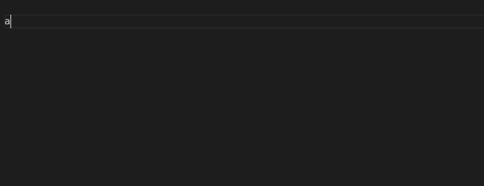

# Reimagining the web with native Web Components

The goal of this lab is to showcase web components as an option when creating web application, with a focus on simplicity and reusability. 


# SetUp
1. Run the following command - `npx dwck project web-components-app` - and hit `y` when asked to confirm. This will deploy the project structure for our lab into this folder and it will create the `web-components-app` (feel free to change the name of the project). 
2. (Update) I might have broke the previous script, if you gen an error, please clone this [repo instead](https://github.com/diegotorres03/web-components-template)
3. Now change directory into the `web-components-app` folder and run `npm install -D`
4. Open the `web-components-app` folder in your code editor of choice.
<!-- 4. Create an `index.html` file in the root of this folder, add the following contents and save: -->
<!-- ```html
<!DOCTYPE html>
<html lang="en">
<head>
    <meta charset="UTF-8">
    <meta http-equiv="X-UA-Compatible" content="IE=edge">
    <meta name="viewport" content="width=device-width, initial-scale=1.0">
    <title>Document</title>
</head>
<body>
    
</body>
</html>
``` -->
4. Finally, run `npm run serve`. This will open a browser with the contents of the `index.html` file. 
<!-- 5. you just created (which is actually an empty page). -->

**Notes:** 
1. In Lessons 1 and 2, unless explicitly directed otherwise, we will be working in the `index.html` file we just created above.
2. If we see a reference like this `tag-name#id-for-this-element`, this measn you should look to add your code in the element that match the tag name and has the respective id. Example, if we are told to add a `h1` on the slot `front` on `flip-card#main-card`:
   ```html
    <flip-card id="third-card"></flip-card>
    <flip-card id="second-card"></flip-card>

    <!-- this is the one you want to use -->
    <flip-card id="main-card">
        <!-- this is the h1 you will be adding, note the slot attribute match with the intruction -->
        <h1 slot="front" >title</h1>
    </flip-card>

   ```
   the format will be `<component tag>#<id for the component>`
3. If you want to speed up you html development, I recommend using [emmet](https://docs.emmet.io/).
   

---

**Good luck and have fun!!**


---

## Content

1. [**Introduction to Web Components**](./lesson-1/lesson-1.md)
    1. [Using our first web component](./lesson-1/section-1/steps.md#section-11-using-our-first-components)
        1. [Add a flip card](./lesson-1/section-1/steps.md#activity-111-add-a-flip-card)
        2. [Create a button and modal](./lesson-1/section-1/steps.md#activity-112-create-a-button-and-a-modal)
        3. [Connect flip to the modal](./lesson-1/section-1/steps.md#activity-113-connect-the-flip-card-to-the-app-modal)
    2. [Creating our first web component](./lesson-1/section-2/steps.md#section-12-creating-our-first-web-component)
        1. [Create required files](./lesson-1/section-2/steps.md#activity-121-create-required-files)
        2. [ Create SecretCardComponent class](./lesson-1/section-2/steps.md#activity-122-create-secretcardcomponent-class)
        3. [Get interactive elements from secret-card.js](./lesson-1/section-2/steps.md#activity-123-get-interactive-elements-from-secret-cardjs)
        4. [Get a value from an attribute](./lesson-1/section-2/steps.md#activity-124-get-a-value-from-an-attribute)
        5. [Implement the `trigger` and `on` attributes](./lesson-1/section-2/steps.md#activity-125-implement-the-trigger-and-on-attributes)
2. [**Composing apps with Web Components**](./lesson-2/lesson-2.md)
    1. [Layout components](./lesson-2/section-1/steps.md#section-21-layout-components) 
        1. [App layout](./lesson-2/section-1/steps.md#activity-211-app-layout)
        2. [Hash routing](./lesson-2/section-1/steps.md#activity-212-hash-routing)
        3. [Grid layout](./lesson-2/section-1/steps.md#activity-213-grid-layout)
    2. [Creating a statefull component](./lesson-2/section-2/steps.md#section-22-creating-a-statefull-component)
        1. [Memory flip game](./lesson-2/#activity-221-memory-flip-game)
        2. [Generating content dynamically](./lesson-2/section-2/steps.md#activity-222-generating-content-dynamically)
        3. [Registering event listeners](./lesson-2/section-2/steps.md#activity-223-registering-event-listeners)
        4. [Emiting event from within the component](./lesson-2/section-2/steps.md#activity-224-emiting-event-from-within-the-component)
    3. [Data components](./lesson-2/section-3/steps.md#section-23-data-components)
        1. [Data point and data set](./lesson-2/section-3/steps.md#activity-231-data-point-and-data-set)
        2. [Data query](./lesson-2/section-3/steps.md#activity-232-data-query)
        3. [Data store](./lesson-2/section-3/steps.md#activity-233-data-store)
        4. [UI sync components](./lesson-2/section-3/steps.md#activity-234-ui-sync-components)
    4. [Event components](./lesson-2/section-4/steps.md#section-24-event-components)
        1. [Basic event handling](./lesson-2/section-4/steps.md#activity-241-basic-event-handling)
        2. [working with multiple event flows](./lesson-2/section-4/steps.md#activity-242-working-with-multiple-event-flows)
        3. [transforms and filters](./lesson-2/section-4/steps.md#activity-243-event-source-filter-and-transforms)


<!-- [step by step guide](./step-by-step.md#chapter-1-intro-to-web-components) -->